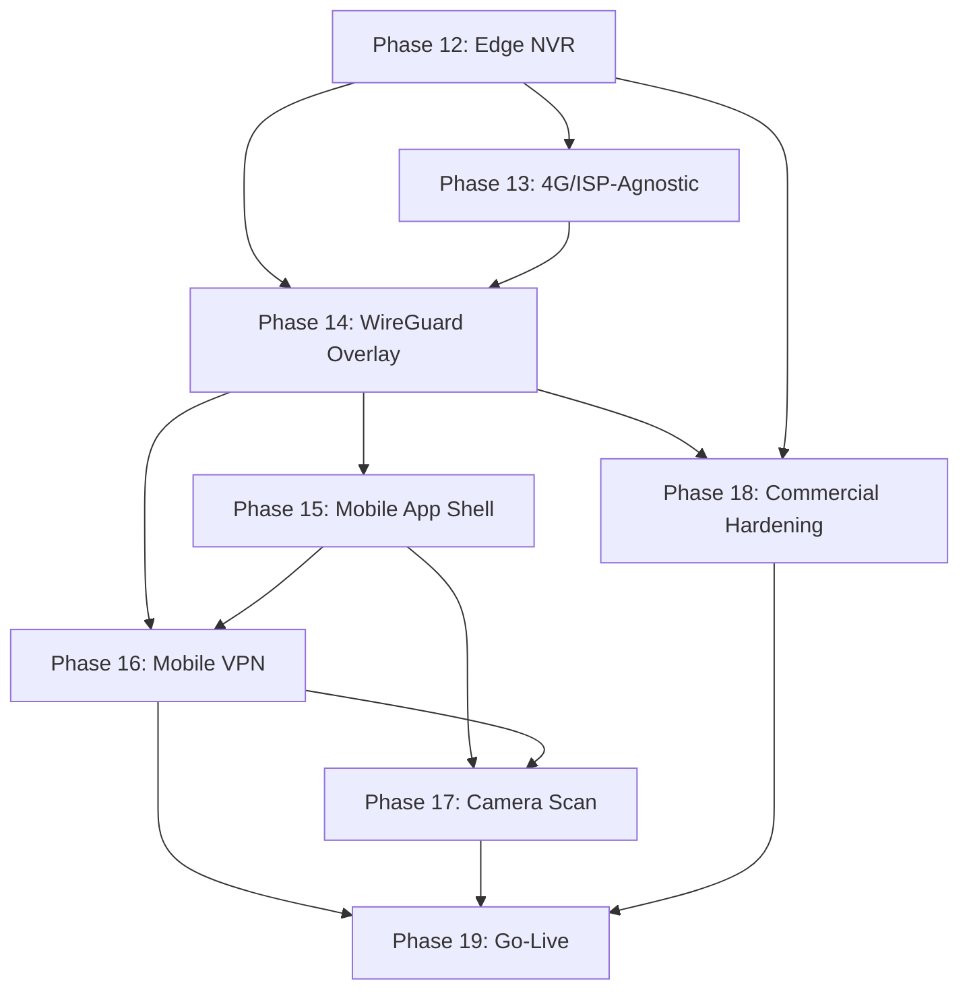

# Sarvanetra — Implementation Plan Part 2
## Commercial Rollout: Phases 12–19
### Edge NVR · Internet-Agnostic Cameras · 4G SIM Support · WireGuard Overlay · Mobile App · Billing · Go-Live

*Extends the Phase 0–11 as-built platform. Phases 0–11 are complete and running. This plan is final and ready for rollout.*

---

## Baseline Confirmed (What Exists Today)

| Phase | Status |
|-------|--------|
| 0–8: Core platform (RTSP/ONVIF ingest, HLS/WebRTC streaming, recording pipeline, Kafka event bus, FastAPI, Kong JWT auth, React frontend) | ✅ Complete, running on `10.44.0.209` |
| A–I: Multi-tenant/RBAC backbone (organizations, customers, roles, permissions, camera groups, audit log, BSNL hierarchy) | ✅ Built and wired |
| 9: Camera health monitoring (`camera_status_log`, health dashboard, `notifier.py` webhook alerts, uptime tracking) | ✅ Complete |
| 10: Retention/cleanup (`minio_cleaner.py` enforcing per-camera `retention_days`, lifecycle policies) | ✅ Complete |
| 11: Hardening (TLS via self-signed certs, CORS lockdown, non-root containers, MinIO IAM, `docker-compose.prod.yml`, structured logging) | ✅ Complete |

> [!IMPORTANT]
> **This plan assumes all Phase 0–11 work is deployed, tested, and stable.** Specifically: migration `0005_camera_health` is applied, the seed script has been run, `get_accessible_cameras()` is enforced on all camera-scoped endpoints, and CORS is locked to `FRONTEND_ORIGIN`. If any of these are unverified, verify before starting Phase 12.

---

## The Problem This Plan Solves

The current system works **only inside the BSNL VLAN 200 intranet** — every camera must be on that private network, and every viewer must be inside it. This limits the product to BSNL-owned infrastructure. For commercial rollout, we need:

1. **Internet-agnostic cameras** — customers using any ISP (Airtel, Jio, ACT, etc.), not just BSNL
2. **4G SIM-based cameras** — cellular cameras at sites with no wired internet (construction sites, farmland, remote offices, temporary event surveillance)
3. **Local recording continuity** — cameras keep recording even when the WAN link to the hub drops
4. **Remote/mobile viewing** — customers view their cameras from anywhere via a mobile app, without exposing any camera port to the public internet
5. **Commercial billing** — usage metering, per-site/per-camera pricing support

---

## Architecture: End State

```
                              ┌─────────────────────────────────────────────────────┐
                              │              SARVANETRA HUB                          │
                              │     (existing Phase 0–11 stack, unchanged)           │
                              │                                                      │
                              │  Kong · FastAPI · Postgres · Redis · Kafka           │
                              │  MinIO (central + backup_clips) · MediaMTX           │
                              │  (for BSNL-VLAN-native cameras — unchanged)          │
                              │                                                      │
                              │  + NEW SERVICES:                                     │
                              │    ┌─────────────────────────────────────────────┐   │
                              │    │ Headscale (WireGuard coordination)          │   │
                              │    │ DERP relay (self-hosted NAT fallback)       │   │
                              │    │ fleet_service (NVR registry, heartbeat)     │   │
                              │    │ acl_sync (RBAC → Headscale ACL tags)        │   │
                              │    │ vpn_session_service (mobile key exchange)   │   │
                              │    │ camera_onboard_service (QR/OCR scan API)    │   │
                              │    │ usage_meter (billing aggregation)           │   │
                              │    └─────────────────────────────────────────────┘   │
                              └──────────┬──────────────────┬──────────┬─────────────┘
                                         │                  │          │
           WireGuard overlay (100.64.x.x)│                  │          │ WireGuard overlay
                    ┌────────────────────┘                  │          └──────────────┐
                    │                                       │                         │
        ┌───────────▼──────────────┐            ┌───────────▼───────────┐  ┌──────────▼──────────────┐
        │  SITE NVR (Wired ISP)    │            │  SITE NVR (4G/LTE)    │  │  MOBILE APP             │
        │  Customer's own internet │            │  SIM-based uplink     │  │                         │
        │                          │            │                       │  │  Embedded WireGuard     │
        │  MediaMTX (local RTSP)   │            │  Same edge stack +    │  │  Session-scoped keys    │
        │  edge-agent              │            │  4G-aware bandwidth   │  │  QR/OCR camera onboard  │
        │  SQLite (local DB)       │            │  management           │  │  Live view + playback   │
        │  local retention cleaner │            │  + failover SIM mgmt  │  │  Push notifications     │
        │  Tailscale client        │            │  Tailscale client     │  │  Biometric app-lock     │
        └───────────┬──────────────┘            └───────────┬───────────┘  └─────────────────────────┘
                    │ LAN (RTSP/ONVIF)                      │ LAN or direct
        ┌───────────▼──────────────┐            ┌───────────▼───────────┐
        │  IP Cameras (any ISP)    │            │  4G SIM Cameras       │
        │  Wired Ethernet/Wi-Fi    │            │  via 4G router/bridge │
        └──────────────────────────┘            └───────────────────────┘
```

---

## Phase 12 — Edge NVR: Site Recording & Local Autonomy

**Goal:** Deploy a lightweight, self-contained NVR appliance at customer premises that records independently and syncs to the hub.

### 12.1 New Service: `edge-agent`

The single new backend service that replaces Kafka/MinIO/Kong at the edge. A Python process with 6 responsibilities:

#### [NEW] `edge-agent/` directory

```
edge-agent/
├── Dockerfile
├── requirements.txt
├── main.py                  # Entry point, orchestrates all loops
├── motion_loop.py           # ONVIF motion detection → local SQLite
├── status_loop.py           # Camera ping → local camera_status_log
├── heartbeat.py             # POST {HUB}/fleet/heartbeat every 30s
├── config_sync.py           # GET {HUB}/fleet/{site}/config every 5min
├── backup_uploader.py       # Upload critical clips to hub MinIO
└── local_retention.py       # Phase 10 minio_cleaner logic for local FS
```

**Key design:**
- Writes to local SQLite (not Postgres — zero admin for field deployment)
- Only outbound connection: WireGuard tunnel to hub overlay IP `100.64.0.1`
- No Kafka dependency — direct function calls within a single process
- Heartbeat carries: site_code, per-camera online/offline, disk_used_pct, uptime, agent_version
- Config sync pulls: camera additions/edits, retention changes, RBAC scope
- Critical-clip backup: on motion event, uploads 15s pre/post-roll clip to hub `backup_clips` bucket

### 12.2 Edge Docker Compose

#### [NEW] [docker-compose.edge.yml](file:///opt/surv-learn/surv/docker-compose.edge.yml)

```yaml
services:
  tailscale:
    image: tailscale/tailscale:latest
    hostname: nvr-${SITE_CODE}
    environment:
      TS_AUTHKEY: ${ENROLLMENT_PREAUTH_KEY}
      TS_EXTRA_ARGS: --login-server=https://${HEADSCALE_DOMAIN}
    cap_add: [NET_ADMIN, NET_RAW]
    volumes: [ts_state:/var/lib/tailscale]
    restart: unless-stopped

  mediamtx:
    build: { context: ., dockerfile: Dockerfile.mediamtx }
    volumes:
      - ./mediamtx/mediamtx-edge.yml:/mediamtx.yml:ro
      - recordings:/recordings
      - hls:/var/hls
    restart: unless-stopped

  edge-agent:
    build: { context: ./edge-agent }
    environment:
      SITE_CODE: ${SITE_CODE}
      HUB_API_URL: http://100.64.0.1:8000/api/v1
      LOCAL_DATABASE_URL: sqlite:////data/edge.db
      BACKUP_ENABLED: ${BACKUP_ENABLED:-true}
      BACKUP_TRIGGER: ${BACKUP_TRIGGER:-motion}    # motion|tamper|manual|all
      BACKUP_CLIP_SECONDS: ${BACKUP_CLIP_SECONDS:-15}
    volumes: [edge_data:/data, recordings:/recordings]
    depends_on: [mediamtx]
    restart: unless-stopped

  local_cleaner:
    build: { context: ./workers, dockerfile: Dockerfile.worker }
    command: python local_retention.py
    volumes: [recordings:/recordings, edge_data:/data]
    restart: unless-stopped
```

**Footprint:** 4 containers, ~2GB RAM. Runs on Intel N100 mini-PC (8 cameras) or RPi5 (1–3 cameras).

### 12.3 Hub-Side Data Model

#### [NEW] [app/alembic/versions/0006_edge_fleet.py](file:///opt/surv-learn/surv/app/alembic/versions/0006_edge_fleet.py)

```sql
CREATE TABLE nvr_node (
  id              SERIAL PRIMARY KEY,
  site_code       VARCHAR(50) UNIQUE NOT NULL,
  customer_site_id INTEGER REFERENCES customer_site(id),
  overlay_ip      VARCHAR(50),           -- 100.64.x.x assigned by Headscale
  wg_node_key     VARCHAR(200),          -- Headscale node identifier
  hardware_label  VARCHAR(100),          -- "Intel N100", "RPi5", etc.
  agent_version   VARCHAR(50),
  last_heartbeat  TIMESTAMPTZ,
  disk_used_pct   NUMERIC(5,2),
  is_provisioned  BOOLEAN DEFAULT false,
  created_at      TIMESTAMPTZ DEFAULT NOW()
);

CREATE TABLE nvr_camera_map (
  nvr_node_id     INTEGER REFERENCES nvr_node(id),
  camera_id       INTEGER REFERENCES survapp_camera_master(id),
  PRIMARY KEY (nvr_node_id, camera_id)
);

CREATE TABLE backup_clip (
  id              BIGSERIAL PRIMARY KEY,
  nvr_node_id     INTEGER REFERENCES nvr_node(id),
  camera_id       INTEGER REFERENCES survapp_camera_master(id),
  object_key      VARCHAR(500),          -- hub MinIO backup_clips bucket
  reason          VARCHAR(50),           -- 'motion', 'manual', 'tamper'
  captured_at     TIMESTAMPTZ,
  uploaded_at     TIMESTAMPTZ DEFAULT NOW()
);

-- Additive column on existing table
ALTER TABLE survapp_camera_master
  ADD COLUMN nvr_node_id INTEGER NULL REFERENCES nvr_node(id);
-- NULL = hub-native (existing BSNL VLAN), non-NULL = edge camera
```

### 12.4 Hub API: Fleet Management

#### [NEW] [app/models/nvr.py](file:///opt/surv-learn/surv/app/models/nvr.py)
SQLAlchemy models: `NvrNode`, `NvrCameraMap`, `BackupClip`

#### [NEW] [app/schemas/fleet.py](file:///opt/surv-learn/surv/app/schemas/fleet.py)
Pydantic schemas: `NvrNodeOut`, `HeartbeatIn`, `FleetConfigOut`, `BackupClipIn`, `NvrProvisionRequest`

#### [NEW] [app/routers/fleet.py](file:///opt/surv-learn/surv/app/routers/fleet.py)
```
POST /api/v1/fleet/heartbeat               ← edge-agent calls every 30s
GET  /api/v1/fleet/{site_code}/config       ← edge-agent pulls camera list + retention
POST /api/v1/fleet/{site_code}/backup-clip  ← edge-agent uploads critical clips
GET  /api/v1/fleet/                         ← admin: list all NVR nodes
POST /api/v1/fleet/                         ← admin: provision new NVR
GET  /api/v1/fleet/{site_code}              ← admin: NVR detail + cameras
DELETE /api/v1/fleet/{site_code}            ← admin: decommission NVR
```

### 12.5 Frontend: NVR Fleet Page

#### [NEW] [frontend/src/pages/NvrFleet.tsx](file:///opt/surv-learn/surv/frontend/src/pages/NvrFleet.tsx)
- NVR grid: site name, overlay IP, last heartbeat (with staleness indicator), disk usage bar, camera count, agent version
- "Add NVR" wizard: select customer site → generate pre-auth key → display QR code for field setup
- Drill into site: camera list with local/hub status comparison
- Decommission flow with confirmation

#### [MODIFY] [frontend/src/components/Sidebar.tsx](file:///opt/surv-learn/surv/frontend/src/components/Sidebar.tsx)
Add "NVR Fleet" nav item (admin/installer role only), with `Server` icon

#### [MODIFY] [frontend/src/App.tsx](file:///opt/surv-learn/surv/frontend/src/App.tsx)
Add `/fleet` route

#### [MODIFY] [frontend/src/api/client.ts](file:///opt/surv-learn/surv/frontend/src/api/client.ts)
Add `fetchFleetNodes()`, `provisionNvr()`, `fetchNvrDetail()`, `decommissionNvr()` functions

### 12.6 Provisioning Flow (Zero-Touch)

1. Admin creates `customer_site` (existing multi-tenant UI) → clicks "Add NVR" in Fleet page
2. Hub calls Headscale API → mints a reusable, time-limited pre-auth key scoped to that site's namespace
3. Admin flashes the box with a boot script that reads `SITE_CODE` + pre-auth key from USB drive or QR code
4. Box boots → Tailscale client connects to Headscale → overlay tunnel up
5. `edge-agent` calls `POST /fleet/heartbeat` → hub creates `nvr_node` row, sets `is_provisioned = true`
6. `edge-agent` pulls camera config → starts recording

---

## Phase 13 — 4G SIM Camera Support & Internet-Agnostic Connectivity

**Goal:** Support cameras on any ISP (not just BSNL VLAN) including 4G/LTE SIM-based cameras, without requiring public IPs or port forwarding.

### 13.1 4G Camera Architecture

> [!IMPORTANT]
> 4G SIM cameras behind CGNAT (Carrier-Grade NAT) **cannot be reached inbound** — they have no public IP. The edge NVR solves this: cameras connect locally (LAN) to the NVR box, and the NVR reaches the hub via an **outbound** WireGuard tunnel. No port forwarding needed anywhere.

**Three deployment patterns for 4G sites:**

| Pattern | Setup | Use Case |
|---------|-------|----------|
| **A. 4G Router + Edge NVR** | 4G SIM router provides LAN; cameras connect via Ethernet; Edge NVR connects via same LAN + WireGuard tunnel out | Standard commercial site (shop, warehouse, office) with 1-8 cameras |
| **B. 4G Camera → Edge NVR Wi-Fi** | Camera with built-in 4G creates a Wi-Fi hotspot; Edge NVR joins camera's network or camera joins NVR's hotspot | Single-camera temporary sites (construction, events) |
| **C. 4G Camera Direct (no edge NVR)** | Camera itself runs Tailscale (if supported) or uses a micro-gateway (RPi Zero W with Tailscale) as a bridge | Ultra-low-cost, 1 camera, no local recording needed |

**Recommended default: Pattern A** — a 4G router + Edge NVR box is the most reliable and gives local recording continuity.

### 13.2 Data Model Extensions for 4G/ISP-Agnostic

#### [MODIFY] [app/alembic/versions/0006_edge_fleet.py](file:///opt/surv-learn/surv/app/alembic/versions/0006_edge_fleet.py)

Add connectivity metadata to `nvr_node`:

```sql
ALTER TABLE nvr_node ADD COLUMN connectivity_type VARCHAR(20) DEFAULT 'wired';
  -- 'wired' | '4g_sim' | 'wifi' | 'starlink'
ALTER TABLE nvr_node ADD COLUMN sim_iccid VARCHAR(30);          -- SIM card ID (4G sites)
ALTER TABLE nvr_node ADD COLUMN sim_carrier VARCHAR(50);         -- 'Jio', 'Airtel', 'BSNL', etc.
ALTER TABLE nvr_node ADD COLUMN data_cap_gb NUMERIC(10,2);       -- Monthly data limit (NULL = unlimited)
ALTER TABLE nvr_node ADD COLUMN data_used_gb NUMERIC(10,2) DEFAULT 0;
ALTER TABLE nvr_node ADD COLUMN signal_strength_dbm INTEGER;     -- LTE signal (reported by edge-agent)
ALTER TABLE nvr_node ADD COLUMN bandwidth_mode VARCHAR(20) DEFAULT 'normal';
  -- 'normal' | 'low_bandwidth' | 'event_only'
```

### 13.3 4G-Aware Bandwidth Management in edge-agent

#### [MODIFY] `edge-agent/config_sync.py`

The edge-agent adapts behavior based on `bandwidth_mode` received from the hub:

| Mode | Behavior | Data Use |
|------|----------|----------|
| `normal` | Full heartbeat (30s), backup clips on motion, full config sync | Standard |
| `low_bandwidth` | Heartbeat every 2 min, backup clips only on tamper events, compressed config sync | ~60% reduction |
| `event_only` | Heartbeat every 5 min, no backup clips (local only), minimal sync | ~90% reduction |

#### [NEW] `edge-agent/connectivity_monitor.py`

For 4G sites:
- Monitors `/sys/class/net/` for cellular interface stats
- Reports `signal_strength_dbm` in heartbeat
- Auto-switches to `low_bandwidth` mode if signal drops below threshold (-100 dBm)
- Queues backup uploads when connectivity is poor, flushes on recovery
- Tracks cumulative `data_used_gb` and warns hub when approaching `data_cap_gb`

### 13.4 Camera Model Registry (for auto-configuration)

#### [NEW] [app/alembic/versions/0007_camera_model_registry.py](file:///opt/surv-learn/surv/app/alembic/versions/0007_camera_model_registry.py)

```sql
CREATE TABLE camera_model_registry (
  id              SERIAL PRIMARY KEY,
  vendor          VARCHAR(100) NOT NULL,      -- 'Hikvision', 'Dahua', 'CP Plus', etc.
  model_pattern   VARCHAR(200),               -- regex for model string matching
  serial_pattern  VARCHAR(200),               -- regex for serial number format
  mac_prefix      VARCHAR(20),                -- OUI prefix, e.g. 'c0:06:c3'
  default_onvif_port   INTEGER DEFAULT 80,
  default_rtsp_port    INTEGER DEFAULT 554,
  default_rtsp_path    VARCHAR(200),           -- e.g. '/Streaming/Channels/101'
  default_username     VARCHAR(50) DEFAULT 'admin',
  supports_4g          BOOLEAN DEFAULT false,  -- has built-in 4G modem
  supports_onvif       BOOLEAN DEFAULT true,
  onvif_profile        VARCHAR(20),            -- 'S', 'T', 'G'
  notes           TEXT,
  created_at      TIMESTAMPTZ DEFAULT NOW(),
  updated_at      TIMESTAMPTZ DEFAULT NOW()
);

-- Seed common vendors
INSERT INTO camera_model_registry (vendor, mac_prefix, default_rtsp_path, supports_onvif) VALUES
('Hikvision',  'c0:06:c3', '/Streaming/Channels/101', true),
('Dahua',      '3c:ef:8c', '/cam/realmonitor?channel=1&subtype=0', true),
('CP Plus',    'e0:50:8b', '/cam/realmonitor?channel=1&subtype=0', true),
('Reolink',    'ec:71:db', '/h264Preview_01_main', true),
('TP-Link',    '98:da:c4', '/stream1', false),
('Uniview',    'e0:37:bf', '/unicast/c1/s0/live', true);
```

#### [NEW] [app/routers/camera_registry.py](file:///opt/surv-learn/surv/app/routers/camera_registry.py)
```
GET    /api/v1/camera-registry/              ← list all models
POST   /api/v1/camera-registry/              ← admin: add new model
PATCH  /api/v1/camera-registry/{id}          ← admin: update model
GET    /api/v1/camera-registry/lookup?mac=   ← lookup by MAC prefix
GET    /api/v1/camera-registry/lookup?serial= ← lookup by serial pattern
```

### 13.5 Frontend: 4G Site Management

#### [MODIFY] [frontend/src/pages/NvrFleet.tsx](file:///opt/surv-learn/surv/frontend/src/pages/NvrFleet.tsx)

Add to the NVR detail view:
- Connectivity type badge (🌐 Wired / 📡 4G / 📶 Wi-Fi)
- For 4G sites: signal strength indicator, data usage bar vs. cap, carrier name, SIM ICCID
- Bandwidth mode selector (Normal / Low Bandwidth / Event Only)
- Data usage alerts when approaching cap

---

## Phase 14 — WireGuard Overlay Network & Secure Remote Access

**Goal:** Deploy Headscale + self-hosted DERP relay on the hub, enabling encrypted connectivity between hub, all edge NVRs, and mobile clients — without exposing any camera port to the public internet.

### 14.1 Headscale Deployment

#### [MODIFY] [docker-compose.yml](file:///opt/surv-learn/surv/docker-compose.yml)

Add Headscale + DERP services:

```yaml
  headscale:
    image: headscale/headscale:latest-alpine
    container_name: surv_headscale
    restart: unless-stopped
    command: serve
    volumes:
      - ./headscale/config.yaml:/etc/headscale/config.yaml:ro
      - headscale_data:/var/lib/headscale
    networks:
      - surv_net
    ports:
      - "8180:8080"     # Headscale API (behind reverse proxy in prod)
    depends_on:
      postgres:
        condition: service_healthy

  derp:
    image: fredliang/derper:latest
    container_name: surv_derp
    restart: unless-stopped
    environment:
      DERP_DOMAIN: ${HEADSCALE_DOMAIN}
      DERP_CERT_MODE: manual
      DERP_CERT_DIR: /certs
    volumes:
      - ./certs:/certs:ro
    networks:
      - surv_net
    ports:
      - "3478:3478/udp"   # STUN
      - "8443:443"         # DERP HTTPS (or share with existing TLS)
```

#### [NEW] [headscale/config.yaml](file:///opt/surv-learn/surv/headscale/config.yaml)

```yaml
server_url: https://${HEADSCALE_DOMAIN}
listen_addr: 0.0.0.0:8080
private_key_path: /var/lib/headscale/private.key
noise:
  private_key_path: /var/lib/headscale/noise_private.key
ip_prefixes:
  - 100.64.0.0/10
db_type: sqlite3
db_path: /var/lib/headscale/db.sqlite
derp:
  server:
    enabled: false     # Using external DERP container
  urls: []
  paths:
    - /etc/headscale/derp.yaml
dns:
  magic_dns: false     # We manage DNS ourselves
  base_domain: sarvanetra.internal
```

#### [NEW] [headscale/acl.hcl](file:///opt/surv-learn/surv/headscale/acl.hcl)

```hcl
{
  "groups": {
    "group:hub": ["hub"],
    "group:nvr": [],          // Populated dynamically by acl_sync
    "group:mobile": []        // Populated dynamically by acl_sync
  },
  "acls": [
    // Hub can reach all NVRs and mobile clients
    {"action": "accept", "src": ["group:hub"], "dst": ["*:*"]},
    // NVRs can reach hub (for heartbeat/API calls)
    {"action": "accept", "src": ["group:nvr"], "dst": ["group:hub:*"]},
    // Mobile clients can reach hub and their authorized NVRs
    {"action": "accept", "src": ["group:mobile"], "dst": ["group:hub:*"]},
    // Per-org mobile→NVR rules injected dynamically by acl_sync
  ]
}
```

### 14.2 ACL Synchronization Service

#### [NEW] [app/services/acl_sync_service.py](file:///opt/surv-learn/surv/app/services/acl_sync_service.py)

Mirrors RBAC → Headscale ACL tags:
- Triggered on: role change, permission change, camera group change, user assignment change
- Reads `organization_id`, `customer_id`, `camera_group` assignments
- Writes Headscale ACL tags scoping which mobile peers can reach which NVR peers
- Uses Headscale gRPC API for tag updates

### 14.3 Overlay Addressing Plan

| Peer Type | Overlay CIDR | Examples |
|-----------|-------------|---------|
| Hub (fleet control plane) | Fixed | `100.64.0.1` |
| Site NVRs (wired) | Dynamic, assigned by Headscale | `100.64.0.10` – `100.64.0.250` |
| Site NVRs (4G) | Dynamic | `100.64.1.0` – `100.64.1.250` |
| Mobile clients | Dynamic, ephemeral per session | `100.64.100.x` |

### 14.4 Stream URL Branching for Edge Cameras

#### [MODIFY] [app/routers/streams.py](file:///opt/surv-learn/surv/app/routers/streams.py)

Extend `GET /streams/{cam_id}/hls-url` to branch on `nvr_camera_map`:

```python
# If camera.nvr_node_id is NULL → hub-native, return existing hub HLS URL (unchanged)
# If camera.nvr_node_id is set → edge camera:
#   1. Look up nvr_node.overlay_ip
#   2. Return http://{overlay_ip}:8080/hls/{cam_path}/index.m3u8?token={jwt}
#   Video flows: Site NVR → WireGuard → Viewer (hub NOT in data path)
```

### 14.5 Edge MediaMTX JWT Validation

#### [MODIFY] `edge-agent/config_sync.py`

On config sync, the edge-agent receives the hub's `KONG_JWT_SECRET` (encrypted in transit via WireGuard) and configures the local MediaMTX's `authHTTPAddress` to validate the same JWT scheme. This means a stream token issued by the hub works to authenticate against an edge NVR's MediaMTX — seamless for the viewer.

### 14.6 New Environment Variables

#### [MODIFY] [.env.example](file:///opt/surv-learn/surv/.env.example)

```env
# Phase 14 — Overlay Network
HEADSCALE_DOMAIN=vpn.sarvanetra.bsnl.co.in
HEADSCALE_API_KEY=                          # Generated post-deployment
DERP_DOMAIN=vpn.sarvanetra.bsnl.co.in
```

---

## Phase 15 — Mobile App: Core Shell & Hub Connectivity

**Goal:** Ship a functional mobile app (Expo/React Native) with auth, dashboard, live view, and playback against hub-native cameras — no VPN yet, validating the core product UX first.

### 15.1 Technology Stack

| Layer | Choice | Rationale |
|-------|--------|-----------|
| Framework | Expo SDK (latest stable), New Architecture | Standard 2026 Expo |
| Navigation | Expo Router (file-based) | Default recommended approach |
| Language | TypeScript, strict mode | Native module boundaries require it |
| Data fetching | TanStack Query v5 | Matches web frontend pattern |
| Local state | Zustand | Lightweight, no Redux boilerplate |
| Secure storage | `expo-secure-store` | iOS Keychain / Android Keystore for JWT + WireGuard keys |
| Biometric | `expo-local-authentication` | Face ID/fingerprint app-lock |
| Push | `expo-notifications` + FCM/APNs | Motion/offline alerts |
| Camera (QR) | `expo-camera` CameraView | Built-in barcode scanning |
| Camera (OCR) | React Native Vision Camera v4 + ML Kit | Per-frame text recognition |
| Crash reporting | Sentry (React Native SDK) | Native stack traces |
| CI/CD | EAS Build + EAS Update | Standard Expo release pipeline |
| Design system | Custom token set sharing web app's Tailwind v4 palette | Visual consistency |

> [!IMPORTANT]
> **This is NOT an Expo Go app.** VPN + OCR require custom native code. We use Expo with a **custom Development Build** via EAS Build. You keep 100% of Expo's DX — just install your own Dev Client instead of the generic Expo Go app.

### 15.2 App Project Setup

#### [NEW] `mobile/` directory (at repo root, sibling to `surv/`)

```
mobile/
├── app.json / app.config.ts
├── package.json
├── tsconfig.json
├── eas.json                           # EAS Build profiles (dev/preview/prod)
├── app/                               # Expo Router file-based routes
│   ├── _layout.tsx                    # Root layout (auth gate + biometric)
│   ├── (auth)/login.tsx               # Login screen
│   ├── (tabs)/
│   │   ├── _layout.tsx                # Tab navigator
│   │   ├── dashboard.tsx              # Camera grid with health badges
│   │   ├── live-view.tsx              # HLS/WebRTC player
│   │   ├── playback.tsx               # Timeline scrubber
│   │   ├── motion-alerts.tsx          # Alert list + deep-link target
│   │   ├── cameras.tsx                # Camera list/detail
│   │   └── settings.tsx               # Account, VPN status, notification prefs
│   ├── cameras/
│   │   ├── [id].tsx                   # Camera detail
│   │   └── scan.tsx                   # Add Camera by Photo (Phase 17)
│   └── fleet/                         # Admin only
│       └── index.tsx                  # NVR fleet overview
├── components/
│   ├── HLSPlayer.tsx                  # HLS.js wrapper for mobile
│   ├── CameraCard.tsx                 # Reusable camera health card
│   ├── StatusBadge.tsx                # Online/offline badge
│   ├── TimelineScrubber.tsx           # Playback timeline
│   └── VpnStatusIndicator.tsx         # Tunnel status (Phase 16)
├── lib/
│   ├── api.ts                         # API client (TanStack Query hooks)
│   ├── auth.ts                        # JWT storage + refresh
│   ├── vpn.ts                         # WireGuard tunnel lifecycle (Phase 16)
│   └── notifications.ts              # FCM/APNs registration
├── modules/                           # Custom Expo Modules (Phase 16)
│   └── wireguard/                     # WireGuard Expo Module
└── assets/
```

### 15.3 Screen Inventory

| Screen | Purpose | Data Source |
|--------|---------|-------------|
| Login | JWT auth + biometric re-entry | `POST /auth/login` |
| Dashboard | Camera grid with health badges | `GET /health/cameras` |
| Live View | HLS/WebRTC playback (single + grid) | `GET /streams/{cam_id}/hls-url` |
| Playback/DVR | Timeline scrubber, per-camera | `GET /recordings/{cam_id}/timeline` |
| Motion Alerts | List + push-notification deep-link target | `GET /motion/` |
| Cameras | List/detail/edit | `GET /cameras/` |
| Add Camera — Scan | QR-first, OCR-fallback (Phase 17) | `POST /cameras/onboard/scan` |
| NVR Fleet (admin) | Site health, provisioning | `GET /fleet/` |
| Settings | Account, VPN status, notification prefs | Local + `/auth/me` |

### 15.4 Hub API Extension for Mobile

#### [NEW] [app/routers/mobile.py](file:///opt/surv-learn/surv/app/routers/mobile.py)

```
POST /api/v1/mobile/register-device        ← FCM/APNs token registration
POST /api/v1/mobile/vpn-session             ← Phase 16: WireGuard key exchange
DELETE /api/v1/mobile/vpn-session           ← Phase 16: revoke VPN peer
GET  /api/v1/mobile/dashboard-summary       ← lightweight aggregate for mobile home
```

#### [NEW] [app/alembic/versions/0008_mobile_devices.py](file:///opt/surv-learn/surv/app/alembic/versions/0008_mobile_devices.py)

```sql
CREATE TABLE mobile_device (
  id              SERIAL PRIMARY KEY,
  user_id         INTEGER REFERENCES survapp_user(id) ON DELETE CASCADE,
  device_token    VARCHAR(500) NOT NULL,     -- FCM/APNs push token
  platform        VARCHAR(20) NOT NULL,      -- 'ios' | 'android'
  device_name     VARCHAR(200),
  app_version     VARCHAR(20),
  wg_public_key   VARCHAR(200),              -- Phase 16: device's WireGuard pubkey
  wg_peer_id      VARCHAR(200),              -- Phase 16: Headscale peer identifier
  is_active       BOOLEAN DEFAULT true,
  last_seen       TIMESTAMPTZ,
  created_at      TIMESTAMPTZ DEFAULT NOW()
);
CREATE INDEX ON mobile_device(user_id);
```

### 15.5 Push Notification Wiring

#### [MODIFY] [workers/notifier.py](file:///opt/surv-learn/surv/workers/notifier.py)

Extend to deliver push notifications to registered mobile devices:
- Query `mobile_device` table for user's registered FCM/APNs tokens
- Use FCM HTTP v1 API (if `FIREBASE_SERVICE_ACCOUNT_JSON` is set) for Android
- Use APNs (via `expo-notifications` server SDK) for iOS
- Push contains metadata only ("Motion at Front Door — tap to view"), no video payload
- Tapping notification deep-links to the relevant camera's live view

---

## Phase 16 — Embedded WireGuard in Mobile App

**Goal:** Seamless, single-app VPN experience — no companion app needed. The Sarvanetra mobile app embeds WireGuard to tunnel all hub/edge traffic.

### 16.1 WireGuard Expo Module

#### [NEW] `mobile/modules/wireguard/`

A **first-party Expo Module** (not an npm wrapper) built on official WireGuard libraries:

```
mobile/modules/wireguard/
├── expo-module.config.json
├── src/
│   └── WireGuardModule.ts              # JS API surface
├── ios/
│   ├── WireGuardModule.swift           # WireGuardKit integration
│   ├── PacketTunnelProvider.swift      # Network Extension
│   └── WireGuardModule.podspec
├── android/
│   ├── WireGuardModule.kt             # com.wireguard.android GoBackend
│   └── WireGuardVpnService.kt         # VpnService implementation
└── plugin/
    └── withWireGuard.ts               # Expo Config Plugin
```

**JS API surface:**
```typescript
import { WireGuardModule } from './modules/wireguard';

// Generate keypair on-device (private key never leaves)
const { publicKey } = await WireGuardModule.generateKeyPair();

// Connect (config from hub's /mobile/vpn-session response)
await WireGuardModule.connect({
  hubEndpoint: 'vpn.sarvanetra.bsnl.co.in:51820',
  hubPublicKey: '...',
  allowedIPs: '100.64.0.0/10',      // Only Sarvanetra overlay traffic
  peerConfig: { ... }
});

// Disconnect
await WireGuardModule.disconnect();

// State stream
WireGuardModule.addStateListener((state) => {
  // 'disconnected' | 'connecting' | 'connected' | 'error'
});
```

**iOS implementation:**
- Wraps `WireGuardKit` (official Apple platforms library)
- Uses `NEPacketTunnelProvider` in a Network Extension target
- Expo Config Plugin adds the extension target + entitlements automatically on `expo prebuild`

**Android implementation:**
- Wraps `com.wireguard.android` `GoBackend` (same code as the Play Store WireGuard app)
- Runs as `VpnService` with foreground notification ("Secure connection active")
- Expo Config Plugin adds `BIND_VPN_SERVICE` permission + foreground service type declaration

### 16.2 Session-Scoped VPN Keys

**Security model — the private key NEVER leaves the device:**

1. On first login, app generates WireGuard keypair **on-device** (in native module)
2. Private key → `expo-secure-store` (iOS Keychain / Android Keystore) — never sent anywhere
3. Public key → `POST /api/v1/mobile/vpn-session` (authenticated with JWT)
4. Hub registers public key as a **short-TTL Headscale peer**, scoped via ACL tags to the user's authorized sites/cameras
5. Hub returns: peer config (hub endpoint, hub public key, allowed IPs, keepalive interval)
6. App configures WireGuard tunnel with this config

**Revocation:**
- Logout → `DELETE /api/v1/mobile/vpn-session` → hub removes Headscale peer
- Session expiry → `acl_sync` removes stale peers
- Role/permission change → `acl_sync` updates ACL tags immediately
- Stolen phone with logged-out app = no active tunnel, no way to re-establish without re-auth

### 16.3 Tunnel Lifecycle (UI-Driven, Not Always-On)

- **Tunnel up:** when user opens Live View, Playback, or any screen needing hub/edge data
- **Tunnel down:** 2-minute grace period after app backgrounds, then disconnect
- **Push notifications:** delivered via standard FCM/APNs (independent of tunnel). Tapping notification triggers tunnel-up just-in-time
- **NOT** requesting Android "Always-on VPN" — wrong mental model, adds friction in store review

### 16.4 Hub Endpoints for Mobile VPN

#### [MODIFY] [app/routers/mobile.py](file:///opt/surv-learn/surv/app/routers/mobile.py)

```
POST /api/v1/mobile/vpn-session
  Body: { public_key: string, device_name: string, platform: "ios"|"android" }
  Response: { hub_endpoint, hub_public_key, allowed_ips, keepalive, peer_ttl_hours }
  Action: Calls Headscale API → registers peer with ACL tags from user's RBAC scope

DELETE /api/v1/mobile/vpn-session
  Action: Calls Headscale API → removes peer
```

### 16.5 App Store Preparation

> [!WARNING]
> **iOS Network Extension entitlement** must be requested from Apple Developer at the START of this phase, not at ship time. This is the single biggest schedule risk.

- iOS: Request `Packet Tunnel Provider` entitlement early; prepare Privacy Nutrition Label
- Android: Declare foreground service type for `VpnService` (Android 14+ requirement)
- Both: Frame app purpose as "private connectivity to customer's own surveillance devices" — not a consumer VPN

---

## Phase 17 — Camera Onboarding by Photo (QR + OCR)

**Goal:** Add cameras by photographing their serial number label — no typing 16-character serials and RTSP URLs by hand.

### 17.1 Two-Tier Capture

#### Tier 1 — QR Code (Zero Custom Native Code)

Uses `expo-camera`'s built-in `CameraView` barcode scanning:
- Many modern IP cameras (Hikvision, Dahua, Reolink) print a QR code on the label
- QR often encodes: serial, model, MAC, sometimes a device UID
- This works **without any custom native module** — cheapest to build, ship first

#### Tier 2 — OCR Fallback (Vision Camera v4 + ML Kit)

When no QR is detected within 3 seconds:
- Switch to live text-recognition overlay
- React Native Vision Camera v4 with ML Kit text-recognition frame-processor plugin
- Fully on-device, no cloud API cost, no data exposure
- Recognized text regions outlined live on preview (same UX as banking apps scanning card numbers)
- Throttled to every 5th frame for battery/thermal management

### 17.2 Parsing Pipeline

1. **Client-side heuristic extraction:**
   - Pattern library for known vendor serial/MAC formats (Hikvision, Dahua, CP Plus, Reolink, Uniview, TP-Link)
   - MAC addresses: unambiguous `XX:XX:XX:XX:XX:XX` / `XXXXXXXXXXXX` patterns
   - Serial numbers: vendor-specific regex from `camera_model_registry`

2. **User confirmation (never silent trust):**
   - Show extracted fields (Serial, MAC, guessed Model) in editable form
   - "Doesn't look right? Retake or edit" affordance
   - Manual fallback always available ("Type it in manually" link)

3. **Submit to hub:**

#### [NEW] [app/routers/camera_onboard.py](file:///opt/surv-learn/surv/app/routers/camera_onboard.py)

```
POST /api/v1/cameras/onboard/scan
  Body: { serial, mac, model_guess, site_code?, photo_base64? }
  Action:
    1. Lookup vendor from serial/MAC prefix → camera_model_registry
    2. Pre-fill default ONVIF port, RTSP path, credentials
    3. Determine local vs. remote onboarding path
  Response: { camera_id, status: "added"|"pending"|"duplicate", defaults_applied }
```

### 17.3 Local vs. Remote Onboarding

**Local** (technician on same LAN as hub/edge NVR):
- Hub/edge-agent runs ONVIF WS-Discovery sweep
- Matches discovered device's MAC against scanned MAC
- Confirms IP, completes registration synchronously
- Technician sees "Camera added" in seconds

**Remote** (technician at customer site, request over mobile VPN):
- Hub creates `pending_camera` record
- Pushes to site's `nvr_node` via `config_sync` channel
- Edge-agent performs ONVIF discovery locally on next poll
- Matches serial/MAC, reports completion to hub
- Push notification confirms success to technician

### 17.4 Edge Cases Handled

| Edge Case | Handling |
|-----------|----------|
| Duplicate serial | Surface immediately with link to existing camera |
| Poor lighting/glare | Torch toggle button + framing overlay + "hold steady" guidance |
| No connectivity | Cache photo + extracted draft locally, queue for next connectivity |
| Label too worn for OCR | "Type it in manually" link always visible |
| Multiple ONVIF devices found | Picker UI: "We found 3 devices on this network — which one?" |

### 17.5 Access Control

- Gated behind existing `camera.create` permission (RBAC)
- Every scan-based onboarding logged to `AuditLog` — same traceability as manual camera creation

---

## Phase 18 — Commercial Hardening: Billing, Metering & Alerting

**Goal:** Add usage metering, tiered billing support, fleet-wide alerting, and operational tooling for commercial deployment.

### 18.1 Usage Metering

#### [NEW] [app/alembic/versions/0009_usage_metering.py](file:///opt/surv-learn/surv/app/alembic/versions/0009_usage_metering.py)

```sql
CREATE TABLE usage_daily (
  id              BIGSERIAL PRIMARY KEY,
  nvr_node_id     INTEGER REFERENCES nvr_node(id),
  organization_id BIGINT REFERENCES organization(id),
  customer_id     BIGINT REFERENCES customer(id),
  usage_date      DATE NOT NULL,
  camera_count    INTEGER DEFAULT 0,
  storage_used_gb NUMERIC(10,2) DEFAULT 0,
  bandwidth_gb    NUMERIC(10,2) DEFAULT 0,    -- WireGuard tunnel traffic
  backup_clips    INTEGER DEFAULT 0,
  active_hours    NUMERIC(6,2) DEFAULT 0,     -- hours NVR was online
  created_at      TIMESTAMPTZ DEFAULT NOW(),
  UNIQUE(nvr_node_id, usage_date)
);
CREATE INDEX ON usage_daily(organization_id, usage_date);
CREATE INDEX ON usage_daily(customer_id, usage_date);

CREATE TABLE billing_plan (
  id              SERIAL PRIMARY KEY,
  name            VARCHAR(100) NOT NULL,      -- 'Basic', 'Professional', 'Enterprise'
  max_cameras     INTEGER,                    -- NULL = unlimited
  max_sites       INTEGER,
  max_storage_gb  NUMERIC(10,2),
  includes_4g     BOOLEAN DEFAULT false,
  includes_mobile BOOLEAN DEFAULT true,
  price_monthly   NUMERIC(10,2),
  is_active       BOOLEAN DEFAULT true,
  created_at      TIMESTAMPTZ DEFAULT NOW()
);

ALTER TABLE customer ADD COLUMN billing_plan_id INTEGER REFERENCES billing_plan(id);
ALTER TABLE customer ADD COLUMN billing_cycle_start DATE;
```

### 18.2 Usage Collection

#### [NEW] [app/services/usage_service.py](file:///opt/surv-learn/surv/app/services/usage_service.py)

- Aggregates heartbeat data into `usage_daily` rollup (runs as scheduled task)
- Per-NVR: camera count, disk usage, online hours
- Per-org/customer: sum across all their NVRs
- Bandwidth tracking from Headscale traffic counters

#### [NEW] [app/routers/usage.py](file:///opt/surv-learn/surv/app/routers/usage.py)

```
GET /api/v1/usage/                          ← admin: all orgs, filterable
GET /api/v1/usage/{org_id}                  ← org-level usage summary
GET /api/v1/usage/{org_id}/{customer_id}    ← customer-level detail
GET /api/v1/usage/export?format=csv         ← downloadable usage report
```

### 18.3 Fleet-Wide Alerting Extensions

#### [MODIFY] [workers/notifier.py](file:///opt/surv-learn/surv/workers/notifier.py)

Extend beyond camera-offline alerts to cover fleet operations:

| Alert Type | Trigger | Channel |
|------------|---------|---------|
| Camera offline > 5 min | `status_monitor` | Webhook + push + in-app |
| NVR heartbeat stale > 3 min | `fleet_service` heartbeat check | Webhook + push + in-app |
| NVR disk > 85% | Heartbeat `disk_used_pct` | Webhook + in-app |
| 4G data usage > 80% of cap | `connectivity_monitor` | Webhook + push + in-app |
| 4G signal critical (< -110 dBm) | `connectivity_monitor` | Webhook + in-app |
| Backup clip upload failed | `backup_uploader` | Webhook + in-app |

### 18.4 Frontend: Usage & Billing Dashboard

#### [NEW] [frontend/src/pages/Usage.tsx](file:///opt/surv-learn/surv/frontend/src/pages/Usage.tsx)

Admin-only page:
- Organization-level usage table: cameras, storage, bandwidth, active hours
- Per-customer drill-down with date range filter
- Usage charts (30-day trend lines)
- CSV export button
- Billing plan assignment per customer

#### [MODIFY] [frontend/src/components/Sidebar.tsx](file:///opt/surv-learn/surv/frontend/src/components/Sidebar.tsx)
Add "Usage & Billing" nav item (admin only)

---

## Phase 19 — Production Go-Live & Multi-Region Readiness

**Goal:** Final hardening, documentation, deployment automation, and preparation for multi-region scaling.

### 19.1 Production Deployment Automation

#### [NEW] `deploy/` directory

```
deploy/
├── hub/
│   ├── install.sh                    # One-shot hub setup script
│   ├── upgrade.sh                    # Rolling upgrade for hub services
│   └── backup.sh                     # Postgres + Headscale + MinIO backup
├── edge/
│   ├── flash-edge-nvr.sh            # Provision edge box from USB/QR
│   ├── edge-upgrade.sh              # OTA edge-agent upgrade via config_sync
│   └── edge-factory-reset.sh        # Wipe and re-provision
├── mobile/
│   ├── eas-build.sh                 # EAS Build wrapper for all profiles
│   └── eas-update.sh                # OTA JS update push
└── monitoring/
    ├── docker-compose.monitoring.yml # Prometheus + Grafana stack
    ├── prometheus.yml                # Scrape configs for all services
    └── dashboards/                   # Pre-built Grafana dashboards
```

### 19.2 Monitoring Stack

#### [NEW] `deploy/monitoring/docker-compose.monitoring.yml`

```yaml
services:
  prometheus:
    image: prom/prometheus:latest
    volumes:
      - ./prometheus.yml:/etc/prometheus/prometheus.yml:ro
    ports: ["9090:9090"]

  grafana:
    image: grafana/grafana:latest
    volumes:
      - grafana_data:/var/lib/grafana
      - ./dashboards:/etc/grafana/provisioning/dashboards
    ports: ["3001:3000"]
    environment:
      GF_SECURITY_ADMIN_PASSWORD: ${GRAFANA_PASSWORD}
```

**Pre-built dashboards:**
- Hub health: API latency, DB connections, Kafka lag, MinIO disk
- Fleet overview: NVR count, online/offline, heartbeat staleness
- 4G fleet: signal strength distribution, data usage across fleet
- Mobile: active sessions, VPN connection counts, push delivery rates

### 19.3 Edge OTA Upgrade Mechanism

#### [MODIFY] `edge-agent/config_sync.py`

Add self-upgrade capability:
- Hub pushes `target_agent_version` in config sync response
- If current version ≠ target, edge-agent pulls new Docker image tag from a private registry
- Performs `docker compose pull && docker compose up -d` with automatic rollback on health check failure
- Reports upgrade status in next heartbeat

### 19.4 Multi-Region Hub Readiness

For customer bases spanning multiple cities:
- Second Headscale-joined hub at a different location
- Sites route to nearest hub based on latency
- Headscale's tailnet model supports this without re-architecting
- Shared Postgres (read replicas) or independent instances with federation API

### 19.5 Documentation Package

#### [NEW] Documentation for commercial deployment:

| Document | Purpose |
|----------|---------|
| `docs/deployment/hub_setup_guide.md` | Complete hub installation from scratch |
| `docs/deployment/edge_nvr_field_guide.md` | Field technician's guide to provisioning edge boxes |
| `docs/deployment/4g_site_setup.md` | 4G router configuration + edge NVR setup for SIM sites |
| `docs/deployment/mobile_app_distribution.md` | EAS Build → App Store / Play Store submission |
| `docs/deployment/monitoring_runbook.md` | Alert response procedures |
| `docs/deployment/backup_restore.md` | Disaster recovery procedures |
| `docs/api/commercial_api_reference.md` | Full API documentation for integrators |
| `docs/security/vpn_architecture.md` | WireGuard/Headscale security model documentation |

---

## Migration Sequence (Complete)

```
0001_initial              ← applied ✅
0002_add_users            ← applied ✅
0003_company_hierarchy    ← applied ✅
0004_bsnl_masters         ← applied ✅
0005_camera_health        ← applied ✅  (Phase 9)
0006_edge_fleet           ← NEW (Phase 12+13: nvr_node, nvr_camera_map, backup_clip, 4G columns)
0007_camera_model_registry ← NEW (Phase 13: vendor → ONVIF/RTSP defaults)
0008_mobile_devices       ← NEW (Phase 15: mobile_device, push tokens, WG keys)
0009_usage_metering       ← NEW (Phase 18: usage_daily, billing_plan)
```

---

## New Files Summary by Phase

| Phase | New/Modified Files |
|-------|-------------------|
| **12** (Edge NVR) | `edge-agent/` (new service: `main.py`, `motion_loop.py`, `status_loop.py`, `heartbeat.py`, `config_sync.py`, `backup_uploader.py`, `local_retention.py`), `docker-compose.edge.yml`, `app/alembic/versions/0006_edge_fleet.py`, `app/models/nvr.py`, `app/schemas/fleet.py`, `app/routers/fleet.py`, `frontend/src/pages/NvrFleet.tsx` |
| **13** (4G/ISP-Agnostic) | `edge-agent/connectivity_monitor.py`, `app/alembic/versions/0007_camera_model_registry.py`, `app/routers/camera_registry.py`, NvrFleet.tsx 4G extensions |
| **14** (WireGuard Overlay) | `headscale/config.yaml`, `headscale/acl.hcl`, `docker-compose.yml` (+headscale, derp services), `app/services/acl_sync_service.py`, `app/routers/streams.py` (branching), `.env.example` |
| **15** (Mobile Shell) | `mobile/` (entire app scaffold), `app/routers/mobile.py`, `app/alembic/versions/0008_mobile_devices.py` |
| **16** (Mobile VPN) | `mobile/modules/wireguard/` (Expo Module), `mobile/lib/vpn.ts`, `app/routers/mobile.py` (VPN session endpoints) |
| **17** (Camera Scan) | `mobile/app/cameras/scan.tsx`, `app/routers/camera_onboard.py` |
| **18** (Billing) | `app/alembic/versions/0009_usage_metering.py`, `app/models/usage.py`, `app/routers/usage.py`, `app/services/usage_service.py`, `workers/notifier.py` (fleet alerts), `frontend/src/pages/Usage.tsx` |
| **19** (Go-Live) | `deploy/` (all scripts), `deploy/monitoring/` (Prometheus + Grafana), docs package |

---

## Execution Order & Dependencies



**Critical path:** Phase 12 → 14 → 15 → 16 → 19

**Parallelizable:**
- Phase 13 (4G support) can run in parallel with Phase 14 (overlay network)
- Phase 17 (camera scan) can start once Phase 15 (app shell) is complete
- Phase 18 (billing) can run in parallel with Phases 16-17

---

## Verification Plan

### Per-Phase Automated Tests

```bash
# Phase 12 — Edge NVR
docker compose -f docker-compose.edge.yml up -d
curl http://100.64.0.1:8000/api/v1/fleet/ | jq '.[] | .site_code'
# Expect: edge NVR registered with is_provisioned=true

# Phase 13 — 4G
curl http://100.64.0.1:8000/api/v1/camera-registry/lookup?mac=c0:06:c3:aa:bb:cc
# Expect: { vendor: "Hikvision", default_rtsp_path: "/Streaming/Channels/101" }

# Phase 14 — Overlay
headscale nodes list  # Expect: hub + registered NVRs
tailscale status      # From edge box: shows connected to hub

# Phase 15 — Mobile
npx expo start --dev-client  # App runs on device, can login and see dashboard

# Phase 16 — VPN
# On mobile: open Live View for edge camera → tunnel comes up → HLS plays

# Phase 17 — Camera Scan
# Point phone at camera label → QR detected → fields pre-filled → submit → camera added

# Phase 18 — Usage
curl -H "Authorization: Bearer <admin_token>" http://localhost:8000/api/v1/usage/ | jq
# Expect: per-org usage aggregates

# Phase 19 — Monitoring
curl http://localhost:9090/targets  # Prometheus: all scrape targets healthy
curl http://localhost:3001          # Grafana: dashboards populated
```

### Manual Verification Checklist

- [ ] Edge NVR records locally when WAN disconnected → reconnects and heartbeats resume
- [ ] 4G site with `low_bandwidth` mode → heartbeat interval changes to 2 min
- [ ] Mobile app: login → dashboard → tap camera → VPN tunnel up → live stream plays
- [ ] Mobile app: receive motion alert push → tap → tunnel up → clip plays
- [ ] Camera scan (QR): scan Hikvision label QR → correct serial/MAC pre-filled
- [ ] Camera scan (OCR): scan text-only label → serial extracted → camera added
- [ ] Kill edge box power → hub shows heartbeat stale alert within 3 min
- [ ] 4G data cap approaching → alert fires at 80% threshold
- [ ] Usage CSV export includes all sites for the billing period
- [ ] `docker compose -f docker-compose.yml -f docker-compose.prod.yml -f deploy/monitoring/docker-compose.monitoring.yml up -d` — full production stack starts clean

---

## Decisions Made (Finalised)

| Decision | Choice | Rationale |
|----------|--------|-----------|
| Overlay technology | **Headscale** (self-hosted Tailscale coordination) | Lighter than NetBird; RBAC already in our app layer |
| Mobile VPN approach | **Embedded WireGuard** (not companion app) | Commercial product needs seamless single-app UX |
| Mobile WireGuard mode | **Plain WireGuard peer → hub** (not full Tailscale client) | Less native engineering; hub-and-spoke fits our model |
| Edge local DB | **SQLite** (not Postgres) | Zero admin for field deployment; single `edge-agent` writer |
| OCR approach | **On-device ML Kit** (no cloud fallback) | Fully offline, no per-scan cost, no data exposure |
| Camera model registry | **Database table** (not hardcoded) | Editable from admin UI; new camera models ship continuously |
| 4G bandwidth management | **Adaptive modes** (normal/low/event-only) | Prevents surprise data bills; auto-switches on poor signal |
| TLS for Headscale | **Real certificate** (Let's Encrypt or purchased) | Headscale needs a stable HTTPS endpoint for peer registration |
| Billing model | **Usage-metered tables** (not integrated payment) | Provides data for billing; actual payment integration is a business decision |

> [!CAUTION]
> **iOS Network Extension entitlement lead time.** Start the Apple Developer entitlement request at the very start of Phase 16, not near ship date. This has historically been the slowest, least predictable step in shipping any embedded-VPN iOS app.

> [!IMPORTANT]
> **`HEADSCALE_DOMAIN` must be a real, resolvable domain** with a valid TLS certificate. This is the one new internet-facing surface the entire plan introduces. It serves only coordination metadata — video never flows through it.

> [!IMPORTANT]
> **Backward compatibility is total.** Existing hub-native cameras on the BSNL VLAN are completely unaffected. `camera_master.nvr_node_id` defaults to `NULL`, and every existing endpoint keeps working exactly as built in Phases 0–11. This extension is purely additive.

---

*This plan extends, and does not replace, the Phase 0–11 as-built platform. It should be read alongside [implementation_status.md](file:///opt/surv-learn/docs/implementation_status.md), [sarvanetra_edge_vpn_extension.md](file:///opt/surv-learn/docs/sarvanetra_edge_vpn_extension.md), and [mobile_desin.md](file:///opt/surv-learn/docs/mobile_desin.md).*
