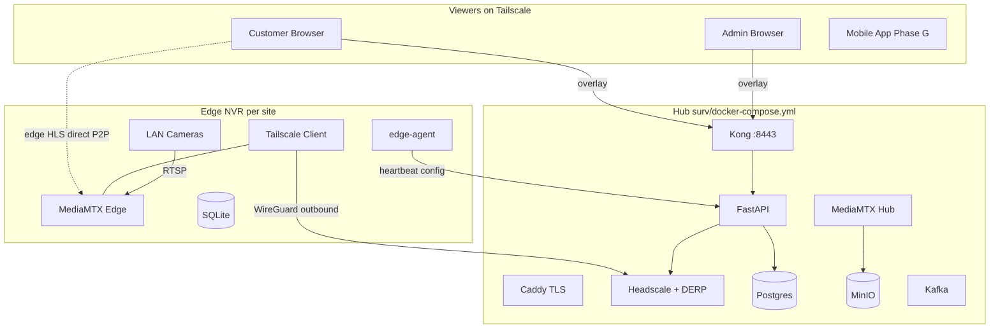
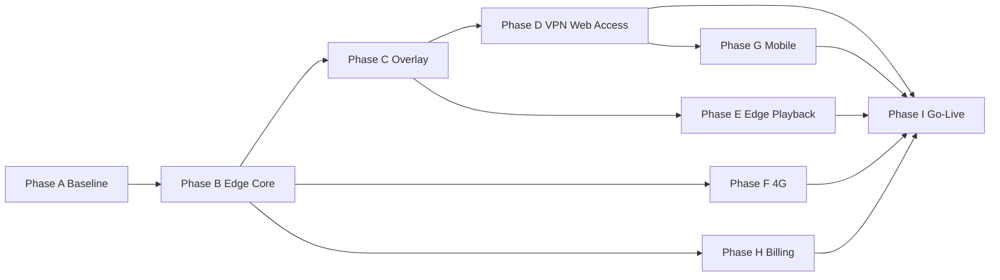

# Sarvanetra — Final System Redesign & Implementation Plan

**Authoritative document for practical implementation.**  
Supersedes fragmented plans in `docs/status/` (historical copies retained with deprecation pointers).

| Item | Value |
|------|-------|
| Branch baseline | `feature/edge-nvr` |
| Hub VM (dev) | `10.44.0.209` |
| Remote access strategy | **VPN-first** (official Tailscale app → self-hosted Headscale) |
| Hub HLS relay for edge cameras | **Not in v1** |
| Last updated | 2026-07-09 |

---

## Table of Contents

1. [Executive Summary](#1-executive-summary)
2. [Current State Audit](#2-current-state-audit)
3. [Target Architecture](#3-target-architecture)
4. [Keep, Modify, Delete](#4-keep-modify-delete)
5. [Phased Implementation](#5-phased-implementation)
6. [Migration Sequence](#6-migration-sequence)
7. [Critical Path & Parallelization](#7-critical-path--parallelization)
8. [Environment & Network Requirements](#8-environment--network-requirements)
9. [Testing Strategy](#9-testing-strategy)
10. [Open Decisions](#10-open-decisions)
11. [Appendices](#11-appendices)

---

## 1. Executive Summary

Sarvanetra began as a **single-hub, LAN-only** CCTV/NVR platform: Docker Compose, MediaMTX, MinIO, Kafka, FastAPI, Kong JWT auth, and a React dashboard — scoped to a private BSNL surveillance VLAN where every camera and viewer sits on the same controlled network.

Commercial requirements extended the product to:

- Customer-premises cameras on **any ISP** (Airtel, Jio, ACT, etc.), not only BSNL VLAN 200
- **4G/SIM** sites with no wired internet
- **Local recording continuity** when the WAN link to the hub drops
- **Remote viewing** from anywhere without exposing camera RTSP/HLS ports on the public internet

### Chosen End-State: Three-Tier Hybrid

| Tier | Role | Technology |
|------|------|------------|
| **Hub** | Control plane, hub-native cameras, central backup, RBAC, billing | Existing Phase 0–11 stack + Headscale + fleet APIs |
| **Edge NVR** | Site appliance: local ingest, record, motion, retention | MediaMTX + `edge-agent` + Tailscale client |
| **Viewer** | Admin/customer remote access | Official Tailscale app (VPN-first) → existing web dashboard over overlay |

**Remote access (confirmed):** Customers and admins install the official Tailscale client pointed at self-hosted Headscale (`vpn.sarvanetra.bsnl.co.in`). No hub HLS relay in v1. Video for edge cameras flows **peer-to-peer over WireGuard**; the hub only brokers stream URLs, ACLs, and metadata.

**Backward compatibility:** Hub-native cameras (`survapp_camera_master.nvr_node_id IS NULL`) are completely unchanged. Every existing endpoint for VLAN cameras continues to work as built in Phases 0–11.

---

## 2. Current State Audit

*Verified against codebase on `feature/edge-nvr`, not aspirational docs.*

### 2.1 Complete — Hub-Native Platform (Phases 0–11)

| Phase | Scope | Status |
|-------|-------|--------|
| 0–8 | Core platform: RTSP/ONVIF ingest, HLS/WebRTC, recording pipeline, Kafka, FastAPI, Kong JWT, React frontend | ✅ Running on `10.44.0.209` |
| A–I | Multi-tenant RBAC: organizations, customers, roles, permissions, camera groups, audit log, BSNL hierarchy | ✅ Built (`0003`, `0004` migrations) |
| 9 | Camera health monitoring (`camera_status_log`, health dashboard, `notifier.py`) | ✅ `0005_camera_health` |
| 10 | Retention/cleanup (`minio_cleaner.py`, per-camera `retention_days`) | ✅ Implemented |
| 11 | Hardening: TLS, CORS lockdown, `docker-compose.prod.yml`, non-root containers | ✅ Partially deployed |

> **Note:** `docs/status/implementation_status.md` incorrectly marks Phases 9–11 as not started. This document reflects the code truth above.

### 2.2 Partially Built — Edge + Overlay (Phases 12–14 scaffold)

| Area | Status | Key Files |
|------|--------|-----------|
| Edge agent | Heartbeat + config sync working; motion, status, backup, retention **stubbed** | `edge-agent/` |
| Fleet API + UI | Provision/list/heartbeat/config; mock `wg_node_key`; **unauthenticated** edge endpoints | `surv/app/routers/fleet.py`, `surv/frontend/src/pages/NvrFleet.tsx` |
| Stream URL branching | Edge HLS returns `overlay_ip:8888`; `overlay_ip` **never populated** | `surv/app/routers/streams.py` |
| Headscale + DERP | Containers in compose; minimal ACL; **no hub Tailscale peer** | `surv/docker-compose.yml`, `surv/headscale/acl.hcl` |
| ACL sync | Stub (`pass`) | `surv/app/services/acl_sync_service.py` |
| VPN peer management | **Not implemented** (`vpn.py` missing) | — |
| Mobile VPN | Returns **501** | `surv/app/routers/mobile.py` |
| Edge playback | Timeline API is hub MinIO only | `surv/app/routers/recordings.py` |
| Simulation harness | Same-VM 3-site sim | `sim/` |

> **Note:** `docs/status/implementation_plan_phase 12+.md` claims Phases 12/14 complete. Code audit above is authoritative.

### 2.3 RBAC Enforcement Gap (Phase A prerequisite)

`get_accessible_camera_ids()` exists in `surv/app/services/access_service.py` and is used in `cameras.py`. **Must verify** enforcement on:

| Endpoint | File | Enforced? |
|----------|------|-----------|
| `GET /cameras/` | `cameras.py` | ✅ Yes |
| `GET /cameras/{cam_id}` | `cameras.py` | ⚠️ Verify |
| `GET /streams/{cam_id}/*` | `streams.py` | ⚠️ Permission only, no camera-scope check |
| `GET /recordings/{cam_id}/*` | `recordings.py` | ⚠️ Permission only, no camera-scope check |
| `GET /motion/` | `motion.py` | ⚠️ No camera filter |

Phase A must close these gaps before edge work proceeds.

### 2.4 Applied Migrations

```
0001_initial
0002_add_users
0003_company_hierarchy
0004_bsnl_masters
0005_camera_health
0006_edge_fleet          ← nvr_node, nvr_camera_map, backup_clip, camera.nvr_node_id
0007_mobile_devices      ← mobile_device table
```

---

## 3. Target Architecture



### 3.1 Camera Placement Model

Single `survapp_camera_master` table; `nvr_node_id` is the discriminator:

| `nvr_node_id` | Mode | Live view path | Recording storage |
|---------------|------|----------------|-------------------|
| `NULL` | Hub-native (BSNL VLAN) | Kong → Nginx → hub MediaMTX | Hub MinIO |
| Set | Edge camera | Direct to `nvr_node.overlay_ip:8888` over overlay | Edge local disk (+ optional backup clips to hub MinIO) |

### 3.2 Security Boundary

Headscale ACL tags are **Tier-1 controls**:

| Tag | Reach |
|-----|-------|
| `group:admin` | Hub admin ports + all NVR overlay IPs |
| `group:customer:<id>` | Kong HTTPS only + own NVR overlay IP HLS port |
| `group:nvr:<site_code>` | Hub API (heartbeat/config) only |

Raw camera video never requires inbound ports on customer routers. All peers dial **outbound** to Headscale/DERP.

### 3.3 Data Flows (End State)

**Hub-native live view (unchanged):**
```
Browser → GET /streams/{cam_id}/hls-url → JWT token
       → Kong /hls/{cam_id}/index.m3u8?token=
       → Nginx → MediaMTX → auth webhook /auth/stream
```

**Edge live view (VPN-first):**
```
Browser (on Tailscale) → GET /streams/{cam_id}/hls-url
                       → http://{overlay_ip}:8888/{cam_id}/index.m3u8?token=
                       → Edge MediaMTX (auth webhook to hub over overlay)
```

**Edge recording playback:**
```
Browser → GET /recordings/{cam_id}/timeline
       → edge_video_segment rows (metadata synced from edge)
       → playback URL: http://{overlay_ip}:8888/recordings/...?token=
```

---

## 4. Keep, Modify, Delete

### 4.1 Keep Unchanged (Hub-Native Path)

- Core hub stack: Kong, FastAPI, Postgres, Redis, Kafka, MinIO, MediaMTX, workers, React frontend
- Hub-native camera flow: ONVIF producer → Kafka → motion consumer; segment upload → MinIO; timeline API
- Multi-tenant RBAC model (`organization`, `customer`, `camera_groups`, `access_service`)
- Kong JWT auth + stream token flow

### 4.2 Modify (Extend, Not Replace)

| Component | Change |
|-----------|--------|
| `surv/app/routers/streams.py` | Edge WebRTC branching; require valid `overlay_ip` (no `127.0.0.1` fallback in prod) |
| `surv/app/routers/recordings.py` | Branch timeline/download for edge cameras via `edge_video_segment` |
| `surv/app/routers/fleet.py` | Real Headscale pre-auth keys; fleet endpoint auth; heartbeat writes `overlay_ip` |
| `surv/app/routers/motion.py` | Add `POST /motion/edge`; filter list endpoints by accessible cameras |
| `surv/headscale/acl.hcl` | Add `group:admin`, dynamic `group:customer:*`, ACL `tests` block |
| `surv/docker-compose.yml` | Hub Tailscale client; bind admin UIs to tailnet |
| `surv/caddy/Caddyfile` | Real cert for `vpn.sarvanetra.bsnl.co.in` |
| `surv/headscale/config.yaml` | `magic_dns: true`, `base_domain: sarvanetra.internal` |
| `surv/mediamtx/mediamtx-edge.yml` | HTTP stream auth webhook |
| `edge-agent/config_sync.py` | RTSP **pull** paths with credentials; push auth config to MediaMTX |
| `surv/frontend/src/pages/LiveView.tsx` | VPN connectivity hint when edge stream fails |
| `surv/frontend/src/pages/Customers.tsx` | "Enable Remote Access" → Tailscale setup link/QR |
| `surv/onvif_producer/onvif_motion_producer.py` | Skip cameras with `nvr_node_id IS NOT NULL` |
| `surv/.env.example` | Headscale API key, fleet auth secrets, overlay addressing |

### 4.3 Delete or Deprecate

| Item | Location | Reason |
|------|----------|--------|
| Mock `wg_node_key = secrets.token_hex(16)` | `fleet.py` provision | Replace with Headscale API |
| `overlay_ip or "127.0.0.1"` fallback | `streams.py` | Fail loudly; forces overlay sync |
| Unauthenticated fleet heartbeat/config | `fleet.py` | Security gap |
| Host-bound admin UIs in prod | `docker-compose.prod.yml` | Tailnet-only after Phase D |
| Hub ONVIF polling of edge LAN cameras | `onvif_motion_producer.py` | Formalize `nvr_node_id` skip |
| Separate `local_cleaner` container (optional) | `docker-compose.edge.yml` | Consolidate into `edge-agent` |

### 4.4 New Components

| Component | Phase | Purpose |
|-----------|-------|---------|
| `surv/app/services/headscale_client.py` | C | Headscale API wrapper |
| `surv/app/routers/vpn.py` | D | Admin/customer VPN peer issuance |
| `surv/app/models/vpn_peer.py` | D | VPN peer tracking |
| `edge-agent/edge_db.py` | B | SQLite schema for local motion/segments/status |
| `edge-agent/segment_sync_loop.py` | E | Sync segment metadata to hub |
| `edge-agent/connectivity_monitor.py` | F | 4G signal/data-cap reporting |
| `surv/app/routers/camera_registry.py` | F | Vendor MAC/serial lookup |
| `surv/frontend/src/pages/VpnAccess.tsx` | D | Admin VPN peer management UI |
| `deploy/` | I | Hub install, edge flash, backup scripts |

---

## 5. Phased Implementation

### Phase A — Baseline Verification Gate

**Duration:** 1 week  
**Goal:** Confirm hub foundation before edge work. **Blocks all subsequent phases if failed.**

#### A.1 Tasks

1. Confirm Alembic head is `0007_mobile_devices`
2. Audit RBAC enforcement on all camera-scoped endpoints
3. Run BSNL hierarchy seed if empty
4. Smoke-test hub-native camera end-to-end
5. Document pass/fail in checklist below

#### A.2 Executable Verification Checklist

```bash
# ── 1. Migration head ──────────────────────────────────────────────────────
docker compose -f surv/docker-compose.yml exec app \
  alembic -c app/alembic.ini current
# EXPECT: 0007_mobile_devices (head)

# ── 2. BSNL hierarchy seeded ───────────────────────────────────────────────
docker compose -f surv/docker-compose.yml exec postgres \
  psql -U surv sarvanetra -c "SELECT COUNT(*) FROM organization;"
# EXPECT: > 0 (run app/scripts/seed_hierarchy.py if 0)

# ── 3. Hub-native smoke test ───────────────────────────────────────────────
# Login
TOKEN=$(curl -s -X POST http://10.44.0.209:8000/api/v1/auth/login \
  -H 'Content-Type: application/json' \
  -d '{"username":"admin","password":"<password>"}' | jq -r .access_token)

# List cameras (scoped)
curl -s -H "Authorization: Bearer $TOKEN" \
  http://10.44.0.209:8000/api/v1/cameras/ | jq 'length'

# HLS URL for hub-native camera
curl -s -H "Authorization: Bearer $TOKEN" \
  http://10.44.0.209:8000/api/v1/streams/CAMKRTVM0001/hls-url | jq .hls_url

# Timeline
curl -s -H "Authorization: Bearer $TOKEN" \
  "http://10.44.0.209:8000/api/v1/recordings/CAMKRTVM0001/timeline?date=$(date +%Y-%m-%d)" | jq .segments | head

# Motion events
curl -s -H "Authorization: Bearer $TOKEN" \
  http://10.44.0.209:8000/api/v1/motion/ | jq 'length'

# ── 4. RBAC enforcement audit (grep) ───────────────────────────────────────
rg "get_accessible_camera_ids" surv/app/routers/
# MUST appear in: cameras.py, streams.py, recordings.py, motion.py (after Phase A fix)

# ── 5. Services healthy ────────────────────────────────────────────────────
curl -s http://10.44.0.209:8000/api/v1/health/services | jq .
```

#### A.3 Code Changes Required in Phase A

| Action | File | Change |
|--------|------|--------|
| MODIFY | `surv/app/routers/streams.py` | After camera lookup, verify `cam.id` in accessible set |
| MODIFY | `surv/app/routers/recordings.py` | Same camera-scope check on timeline/download |
| MODIFY | `surv/app/routers/motion.py` | Filter motion list by accessible camera IDs |
| MODIFY | `surv/app/routers/cameras.py` | Verify `GET /{cam_id}` checks accessible set |

#### A.4 Rollback

No schema changes. Revert RBAC patches if they break existing admin workflows.

#### A.5 Exit Criteria

- [ ] Alembic at `0007_mobile_devices`
- [ ] Seed script run (org count > 0)
- [ ] Hub-native live view, playback, motion all work
- [ ] `get_accessible_camera_ids` enforced on cameras, streams, recordings, motion
- [ ] Non-admin user cannot access out-of-scope camera via direct API call

---

### Phase B — Complete Edge NVR Core

**Duration:** 2–3 weeks  
**Goal:** Production-ready edge agent — local record, motion, retention, backup, config sync.

#### B.1 edge-agent Module Implementation

| Module | Current | Target Implementation |
|--------|---------|----------------------|
| `heartbeat.py` | ✅ Working | Add `overlay_ip` (read from `tailscale ip -4`), `signal_strength_dbm` placeholder |
| `config_sync.py` | ⚠️ Partial | RTSP pull: `POST /v3/config/paths/add/{cam_id}` with `source: rtsp://user:pass@ip:port/path` |
| `motion_loop.py` | ❌ Stub | Port ONVIF logic from `onvif_motion_producer.py`; write to SQLite; POST to hub |
| `status_loop.py` | ❌ Stub | RTSP OPTIONS ping; local `camera_status_log`; include deltas in heartbeat |
| `local_retention.py` | ❌ Stub | Port `minio_cleaner.py` algorithm to walk `/recordings` by `retention_days` |
| `backup_uploader.py` | ❌ Stub | On motion: extract 15s fmp4 clip → upload hub MinIO `backup_clips` → POST backup-clip |
| `edge_db.py` | ❌ Missing | SQLite: `motion_event`, `video_segment`, `camera_status_log` |

#### B.2 File Checklist — Phase B

| Action | Path | Description |
|--------|------|-------------|
| NEW | `edge-agent/edge_db.py` | SQLite schema + helpers |
| MODIFY | `edge-agent/motion_loop.py` | Full ONVIF motion detection |
| MODIFY | `edge-agent/status_loop.py` | Camera reachability polling |
| MODIFY | `edge-agent/local_retention.py` | Filesystem retention enforcement |
| MODIFY | `edge-agent/backup_uploader.py` | MinIO upload + hub metadata POST |
| MODIFY | `edge-agent/config_sync.py` | RTSP pull paths with credentials |
| MODIFY | `edge-agent/heartbeat.py` | Add `overlay_ip` to payload |
| MODIFY | `edge-agent/main.py` | Wire `edge_db` init; env vars for MinIO hub endpoint |
| MODIFY | `edge-agent/requirements.txt` | Add `onvif-zeep`, `boto3` for backup upload |
| NEW | `surv/app/alembic/versions/0008_edge_segments.py` | `edge_video_segment` table; `nvr_node.site_enrollment_secret` |
| NEW | `surv/app/models/edge_segment.py` | SQLAlchemy model |
| MODIFY | `surv/app/schemas/fleet.py` | `HeartbeatIn.overlay_ip`; `FleetConfigOut.site_enrollment_secret` |
| MODIFY | `surv/app/routers/fleet.py` | Auth via `X-Site-Token`; write `overlay_ip` on heartbeat; camera mapping endpoints |
| NEW | `surv/app/routers/motion.py` → `POST /motion/edge` | Edge motion ingest (site-token auth) |
| MODIFY | `surv/app/models/nvr.py` | `site_enrollment_secret` column |
| MODIFY | `surv/frontend/src/pages/NvrFleet.tsx` | Camera-to-NVR mapping UI; disk/agent version display |
| MODIFY | `surv/frontend/src/api/client.ts` | `assignCameraToNvr()`, `removeCameraFromNvr()` |
| MODIFY | `surv/docker-compose.edge.yml` | Hub MinIO creds for backup uploader; optional remove `local_cleaner` |
| MODIFY | `surv/onvif_producer/onvif_motion_producer.py` | Skip `nvr_node_id IS NOT NULL` cameras |
| DELETE | `edge-agent` stub sleep-only logic | Replace with real implementations |

#### B.3 Schema — Migration `0008_edge_segments`

```sql
ALTER TABLE nvr_node ADD COLUMN site_enrollment_secret VARCHAR(64);

CREATE TABLE edge_video_segment (
  id              BIGSERIAL PRIMARY KEY,
  camera_id       INTEGER REFERENCES survapp_camera_master(id),
  nvr_node_id     INTEGER REFERENCES nvr_node(id),
  segment_start   TIMESTAMPTZ NOT NULL,
  segment_end     TIMESTAMPTZ NOT NULL,
  local_path      VARCHAR(500) NOT NULL,
  file_size_bytes BIGINT,
  synced_at       TIMESTAMPTZ DEFAULT NOW(),
  UNIQUE (nvr_node_id, camera_id, segment_start)
);
CREATE INDEX ON edge_video_segment (camera_id, segment_start);
```

#### B.4 API Endpoints — Phase B

| Method | Path | Auth | Description |
|--------|------|------|-------------|
| POST | `/api/v1/fleet/heartbeat` | `X-Site-Token` | Edge heartbeat (add `overlay_ip`) |
| GET | `/api/v1/fleet/{site_code}/config` | `X-Site-Token` | Camera list + JWT secret + enrollment secret |
| POST | `/api/v1/fleet/{site_code}/backup-clip` | `X-Site-Token` | Register uploaded clip metadata |
| POST | `/api/v1/fleet/{site_code}/cameras` | Admin JWT | Assign camera to NVR |
| DELETE | `/api/v1/fleet/{site_code}/cameras/{cam_id}` | Admin JWT | Unassign camera from NVR |
| POST | `/api/v1/motion/edge` | `X-Site-Token` | Edge motion event ingest |

**Modified request — `HeartbeatIn`:**
```json
{
  "site_code": "SITE01",
  "agent_version": "1.0.0",
  "disk_used_pct": 42.5,
  "uptime_seconds": 86400,
  "online_cameras": ["SIMCAM-SITE01-01"],
  "overlay_ip": "100.64.0.15"
}
```

#### B.5 Verification

```bash
./sim/sim_manage.sh up
docker compose -f surv/docker-compose.yml exec postgres \
  psql -U surv sarvanetra -c "SELECT site_code, last_heartbeat, overlay_ip FROM nvr_node;"
./sim/sim_manage.sh chaos pause SITE01   # WAN drop — local recording continues
./sim/inject_motion.py --site SITE01 --camera SIMCAM-SITE01-01
```

#### B.6 Rollback

- Stop edge stacks: `./sim/sim_manage.sh down`
- Revert migration: `alembic downgrade 0007_mobile_devices`
- Fleet endpoints revert to unauthenticated (dev only)

#### B.7 Exit Criteria

- [ ] All 6 edge-agent loops functional (no sleep stubs)
- [ ] RTSP pull from camera IPs works on sim sites
- [ ] Motion events from edge reach hub DB
- [ ] Local retention deletes old segments
- [ ] Backup clip uploads to hub MinIO on motion
- [ ] Fleet endpoints require `X-Site-Token`
- [ ] NvrFleet UI can assign cameras to sites

---

### Phase C — Overlay Network Integration

**Duration:** 2 weeks  
**Goal:** Real Headscale enrollment, populated `overlay_ip`, edge live view over VPN.

#### C.1 File Checklist — Phase C

| Action | Path | Description |
|--------|------|-------------|
| NEW | `surv/app/services/headscale_client.py` | Headscale HTTP API client (see Appendix C) |
| MODIFY | `surv/docker-compose.yml` | Add `tailscale-hub` service (hostname `hub`, IP `100.64.0.1`) |
| MODIFY | `surv/caddy/Caddyfile` | BSNL wildcard cert for `vpn.sarvanetra.bsnl.co.in` |
| MODIFY | `surv/headscale/config.yaml` | `magic_dns: true`, `server_url` HTTPS |
| MODIFY | `surv/headscale/acl.hcl` | `group:admin`, `group:customer:*`, ACL tests |
| MODIFY | `surv/app/services/acl_sync_service.py` | Full RBAC → ACL reconciliation |
| MODIFY | `surv/app/routers/fleet.py` | Headscale pre-auth key on provision; overlay_ip sync on heartbeat |
| MODIFY | `surv/mediamtx/mediamtx-edge.yml` | `authMethod: http`, `authHTTPAddress` |
| MODIFY | `edge-agent/config_sync.py` | Push stream-auth URL to edge MediaMTX |
| MODIFY | `surv/app/routers/streams.py` | Remove `127.0.0.1` fallback; 503 if no overlay_ip; WebRTC edge branch |
| MODIFY | `surv/.env.example` | `HEADSCALE_API_KEY`, `HEADSCALE_API_URL` |
| DELETE | `secrets.token_hex(16)` mock wg_node_key | `fleet.py` provision |

#### C.2 Hub Tailscale Client (docker-compose addition)

```yaml
  tailscale-hub:
    image: tailscale/tailscale:latest
    hostname: hub
    environment:
      TS_AUTHKEY: ${HUB_TAILSCALE_AUTHKEY}
      TS_EXTRA_ARGS: --login-server=https://${HEADSCALE_DOMAIN} --accept-routes
    cap_add: [NET_ADMIN, NET_RAW]
    volumes: [ts_hub_state:/var/lib/tailscale]
    network_mode: host   # or shared netns with Kong for 100.64.0.1 reachability
    restart: unless-stopped
```

Edge `HUB_API_URL` must change from LAN IP to `http://100.64.0.1:8000/api/v1`.

#### C.3 ACL Policy Template

```hcl
{
  "groups": {
    "group:hub": ["tag:hub"],
    "group:admin": [],
    "group:nvr": [],
    "group:customer": [],
    "group:mobile": []
  },
  "acls": [
    {"action": "accept", "src": ["group:hub"], "dst": ["*:*"]},
    {"action": "accept", "src": ["group:admin"], "dst": ["group:hub:*", "group:nvr:*"]},
    {"action": "accept", "src": ["group:nvr"], "dst": ["group:hub:8000", "group:hub:443"]},
    {"action": "accept", "src": ["group:customer"], "dst": ["group:hub:443", "group:hub:8443"]}
  ],
  "tests": [
    {
      "src": "group:customer:99",
      "accept": ["group:hub:443"],
      "deny": ["group:hub:8001", "group:hub:9001", "group:nvr:22"]
    }
  ]
}
```

Per-customer NVR reach rules injected dynamically by `acl_sync_service`.

#### C.4 API Endpoints — Phase C

No new public endpoints. Modified behavior:

| Endpoint | Change |
|----------|--------|
| `POST /fleet/` | Returns real Headscale pre-auth key in `wg_node_key` |
| `POST /fleet/heartbeat` | Hub queries Headscale → writes `overlay_ip`, `wg_node_key` |
| `DELETE /fleet/{site_code}` | Revokes Headscale node + pre-auth key |
| `GET /streams/{cam_id}/hls-url` | 503 if edge camera and `overlay_ip` is null |

#### C.5 Verification

```bash
docker compose exec headscale headscale nodes list
# EXPECT: hub + SITE01/02/03 with 100.64.x.x addresses

# From Tailscale-connected machine:
curl -H "Authorization: Bearer $TOKEN" \
  https://hub.sarvanetra.internal/api/v1/streams/SIMCAM-SITE01-01/hls-url
# HLS plays from edge overlay IP
```

#### C.6 Rollback

- Revert edge `HUB_API_URL` to LAN IP for dev
- Disable edge MediaMTX auth (open read) temporarily
- Headscale nodes can be manually removed: `headscale nodes delete -i <id>`

#### C.7 Exit Criteria

- [ ] Hub + all sim NVRs visible in `headscale nodes list`
- [ ] `nvr_node.overlay_ip` populated automatically
- [ ] Edge HLS requires valid stream token
- [ ] `acl_sync_service` runs on role/customer change (not stub)
- [ ] Edge live view works from Tailscale-connected browser

---

### Phase D — VPN-First Remote Web Access

**Duration:** 1–2 weeks  
**Goal:** Admins and customers reach dashboard + edge cameras via official Tailscale app.

#### D.1 File Checklist — Phase D

| Action | Path | Description |
|--------|------|-------------|
| NEW | `surv/app/alembic/versions/0009_vpn_peers.py` | `vpn_peer` table; `customer.remote_access_enabled` |
| NEW | `surv/app/models/vpn_peer.py` | SQLAlchemy model |
| NEW | `surv/app/schemas/vpn.py` | Pydantic request/response schemas |
| NEW | `surv/app/routers/vpn.py` | VPN peer CRUD (see Appendix D) |
| MODIFY | `surv/app/main.py` | Register `vpn` router |
| MODIFY | `surv/app/services/acl_sync_service.py` | Admin + customer peer tag sync |
| MODIFY | `surv/app/routers/auth.py` | On user deactivate → revoke VPN peers |
| MODIFY | `surv/app/routers/customers.py` | `remote_access_enabled` toggle |
| NEW | `surv/frontend/src/pages/VpnAccess.tsx` | Peer table, issue flows, QR code |
| MODIFY | `surv/frontend/src/pages/Customers.tsx` | "Enable Remote Access" button |
| MODIFY | `surv/frontend/src/pages/LiveView.tsx` | "Connect Tailscale" hint on edge stream failure |
| MODIFY | `surv/frontend/src/components/Sidebar.tsx` | VPN Access nav item (admin) |
| MODIFY | `surv/frontend/src/App.tsx` | `/vpn` route |
| MODIFY | `surv/docker-compose.prod.yml` | Bind admin ports to tailnet only |

#### D.2 Schema — Migration `0009_vpn_peers`

```sql
CREATE TABLE vpn_peer (
  id               SERIAL PRIMARY KEY,
  subject_type     VARCHAR(20) NOT NULL,   -- 'admin' | 'customer'
  subject_id       INTEGER NOT NULL,
  headscale_tag    VARCHAR(100) NOT NULL,
  pre_auth_key_id  VARCHAR(100),
  device_label     VARCHAR(100),
  issued_at        TIMESTAMPTZ DEFAULT NOW(),
  expires_at       TIMESTAMPTZ,
  revoked_at       TIMESTAMPTZ,
  last_seen        TIMESTAMPTZ
);
CREATE INDEX ON vpn_peer (subject_type, subject_id);

ALTER TABLE customer ADD COLUMN remote_access_enabled BOOLEAN DEFAULT false;
```

#### D.3 API Endpoints — Phase D

| Method | Path | Auth | Description |
|--------|------|------|-------------|
| POST | `/api/v1/vpn/peers` | Admin | Issue peer for user or customer |
| GET | `/api/v1/vpn/peers` | Admin | List all peers with online status |
| GET | `/api/v1/vpn/peers/me` | JWT | List own active peers |
| DELETE | `/api/v1/vpn/peers/{id}` | Admin | Revoke peer immediately |
| PATCH | `/api/v1/customers/{id}` | Admin | Set `remote_access_enabled` |

#### D.4 Admin Port Hardening (after pilot)

| Service | Port | Action |
|---------|------|--------|
| Kong Admin | 8001 | Bind to `100.64.0.0/10` only |
| Konga | 1337 | Tailnet only |
| MinIO Console | 9001 | Tailnet only |
| Kafka UI | 8090 | Tailnet only |
| Headscale API | 8180 | Tailnet only (except OIDC callback if added later) |

#### D.5 Verification

- Admin off-VLAN installs Tailscale → reaches `https://hub.sarvanetra.internal`
- Customer peer sees only own cameras in live view
- ACL test: customer cannot `curl` Kong Admin `:8001`

#### D.6 Rollback

- Revoke all issued pre-auth keys via Headscale CLI
- Re-expose admin ports on LAN (dev fallback)
- Drop `vpn_peer` table: `alembic downgrade 0008_edge_segments`

#### D.7 Exit Criteria

- [ ] Admin can manage platform fully off-VLAN via Tailscale
- [ ] Customer remote access issued from Customers page
- [ ] VPN peer auto-revoked on user/customer deactivation
- [ ] Admin ports locked to tailnet in prod compose
- [ ] MagicDNS resolves `hub.sarvanetra.internal`

---

### Phase E — Unified Playback for Edge Cameras

**Duration:** 1–2 weeks  
**Goal:** Playback page works for edge cameras, not just hub MinIO.

**Approach:** Sync segment metadata to hub; serve files from edge on demand over overlay (VPN-first compatible).

#### E.1 File Checklist — Phase E

| Action | Path | Description |
|--------|------|-------------|
| NEW | `edge-agent/segment_sync_loop.py` | Scan `/recordings`; POST metadata to hub |
| MODIFY | `edge-agent/main.py` | Start segment sync loop |
| MODIFY | `surv/app/routers/fleet.py` | `POST /fleet/{site_code}/segments` bulk ingest |
| MODIFY | `surv/app/routers/recordings.py` | Branch on `nvr_node_id`; edge segment URLs with token |
| MODIFY | `surv/app/schemas/recording.py` | `SegmentOut.source` enum: `hub` \| `edge` |
| MODIFY | `surv/app/schemas/fleet.py` | `SegmentSyncIn`, `SegmentSyncBatch` |
| MODIFY | `surv/frontend/src/pages/Playback.tsx` | Token refresh on 401 for edge URLs |
| MODIFY | `surv/frontend/src/pages/MotionEvents.tsx` | Edge playback deep-link uses edge segments |
| MODIFY | `surv/frontend/src/components/Timeline.tsx` | Handle empty hub segments vs edge segments |

#### E.2 API Endpoints — Phase E

| Method | Path | Auth | Description |
|--------|------|------|-------------|
| POST | `/api/v1/fleet/{site_code}/segments` | `X-Site-Token` | Bulk upsert edge segment metadata |
| GET | `/api/v1/recordings/{cam_id}/timeline` | JWT | Returns hub or edge segments based on `nvr_node_id` |
| GET | `/api/v1/recordings/{cam_id}/download` | JWT | Presigned MinIO URL (hub) or overlay URL with token (edge) |

**Edge segment playback URL pattern:**
```
http://{overlay_ip}:8888/recordings/{cam_id}/{filename}?token={jwt}
```

#### E.3 segment_sync_loop Behavior

1. Every 5 minutes, walk `/recordings/{cam_id}/` directories
2. For each `.mp4` / `.fmp4` not yet synced, read mtime → infer `segment_start`/`segment_end`
3. `POST /fleet/{site_code}/segments` with batch payload
4. Hub upserts into `edge_video_segment` (dedupe on `nvr_node_id + camera_id + segment_start`)

#### E.4 Verification

```bash
# After sim sites record for 5+ minutes:
docker compose exec postgres psql -U surv sarvanetra \
  -c "SELECT COUNT(*) FROM edge_video_segment;"

# Playback API for edge camera returns segments with overlay URLs
curl -H "Authorization: Bearer $TOKEN" \
  "http://10.44.0.209:8000/api/v1/recordings/SIMCAM-SITE01-01/timeline?date=$(date +%Y-%m-%d)"
```

#### E.5 Rollback

- Disable segment sync loop in edge-agent
- Recordings router falls back to hub-only query (edge cameras show empty timeline)

#### E.6 Exit Criteria

- [ ] Edge segment count in hub DB matches local files
- [ ] Playback scrub works for edge camera over Tailscale
- [ ] Motion → playback deep-link lands on correct edge segment
- [ ] Hub-native playback unchanged

---

### Phase F — 4G and Internet-Agnostic Sites

**Duration:** 1–2 weeks  
**Goal:** SIM-based uplinks with bandwidth governance and camera model registry.

#### F.1 File Checklist — Phase F

| Action | Path | Description |
|--------|------|-------------|
| NEW | `surv/app/alembic/versions/0010_nvr_connectivity.py` | 4G columns on `nvr_node` |
| NEW | `surv/app/alembic/versions/0011_camera_model_registry.py` | Vendor defaults table |
| NEW | `edge-agent/connectivity_monitor.py` | Signal/data monitoring |
| NEW | `surv/app/models/camera_registry.py` | SQLAlchemy model |
| NEW | `surv/app/routers/camera_registry.py` | MAC/serial lookup API |
| NEW | `surv/app/schemas/camera_registry.py` | Pydantic schemas |
| MODIFY | `edge-agent/heartbeat.py` | Include connectivity fields |
| MODIFY | `edge-agent/config_sync.py` | Respect `bandwidth_mode` from hub config |
| MODIFY | `surv/app/routers/fleet.py` | PATCH bandwidth mode on NVR |
| MODIFY | `surv/frontend/src/pages/NvrFleet.tsx` | 4G badges, signal meter, data cap bar |

#### F.2 Schema — Migration `0010_nvr_connectivity`

```sql
ALTER TABLE nvr_node ADD COLUMN connectivity_type VARCHAR(20) DEFAULT 'wired';
ALTER TABLE nvr_node ADD COLUMN sim_iccid VARCHAR(30);
ALTER TABLE nvr_node ADD COLUMN sim_carrier VARCHAR(50);
ALTER TABLE nvr_node ADD COLUMN data_cap_gb NUMERIC(10,2);
ALTER TABLE nvr_node ADD COLUMN data_used_gb NUMERIC(10,2) DEFAULT 0;
ALTER TABLE nvr_node ADD COLUMN signal_strength_dbm INTEGER;
ALTER TABLE nvr_node ADD COLUMN bandwidth_mode VARCHAR(20) DEFAULT 'normal';
```

#### F.3 Schema — Migration `0011_camera_model_registry`

```sql
CREATE TABLE camera_model_registry (
  id                  SERIAL PRIMARY KEY,
  vendor              VARCHAR(100) NOT NULL,
  model_pattern       VARCHAR(200),
  serial_pattern      VARCHAR(200),
  mac_prefix          VARCHAR(20),
  default_onvif_port  INTEGER DEFAULT 80,
  default_rtsp_port   INTEGER DEFAULT 554,
  default_rtsp_path   VARCHAR(200),
  default_username    VARCHAR(50) DEFAULT 'admin',
  supports_4g         BOOLEAN DEFAULT false,
  supports_onvif        BOOLEAN DEFAULT true,
  notes               TEXT,
  created_at          TIMESTAMPTZ DEFAULT NOW()
);
```

Seed Hikvision, Dahua, CP Plus, Reolink, TP-Link, Uniview entries.

#### F.4 Bandwidth Modes

| Mode | Heartbeat interval | Backup clips | Config sync |
|------|-------------------|--------------|-------------|
| `normal` | 30s | On motion | 5 min |
| `low_bandwidth` | 2 min | Tamper only | 15 min |
| `event_only` | 5 min | None | 30 min |

#### F.5 API Endpoints — Phase F

| Method | Path | Auth | Description |
|--------|------|------|-------------|
| GET | `/api/v1/camera-registry/` | JWT | List all models |
| POST | `/api/v1/camera-registry/` | Admin | Add model |
| GET | `/api/v1/camera-registry/lookup?mac=` | JWT | Lookup by MAC prefix |
| GET | `/api/v1/camera-registry/lookup?serial=` | JWT | Lookup by serial pattern |
| PATCH | `/api/v1/fleet/{site_code}` | Admin | Set `bandwidth_mode`, connectivity metadata |

#### F.6 Exit Criteria

- [ ] 4G metadata visible in NvrFleet UI
- [ ] Auto-switch to `low_bandwidth` when signal < -100 dBm
- [ ] Camera registry returns Hikvision defaults for `c0:06:c3` MAC
- [ ] Data cap alert fires at 80% threshold

---

### Phase G — Mobile App (Deferred)

**Duration:** 6–8 weeks  
**Goal:** Native iOS/Android with embedded WireGuard.  
**Starts after:** Phase D validates ACL model in production.

| Sub-phase | Scope | Key Deliverables |
|-----------|-------|------------------|
| G.1 | App shell | `mobile/` Expo project; login, dashboard, live view (hub cameras) |
| G.2 | Embedded VPN | `mobile/modules/wireguard/`; replace 501 stub in `mobile.py` |
| G.3 | Edge support | Live/playback for edge cameras over embedded tunnel |
| G.4 | Camera scan | QR/OCR onboarding per `docs/status/mobile_desin.md` |

**Prerequisite:** Request iOS Network Extension entitlement at start of G.2.

Official Tailscale app (Phase D) remains valid for desktop customers; mobile app is additive.

---

### Phase H — Commercial Operations

**Duration:** 2 weeks  
**Goal:** Usage metering, fleet alerting, billing data.

#### H.1 File Checklist — Phase H

| Action | Path | Description |
|--------|------|-------------|
| NEW | `surv/app/alembic/versions/0012_usage_metering.py` | `usage_daily`, `billing_plan` |
| NEW | `surv/app/models/usage.py` | SQLAlchemy models |
| NEW | `surv/app/services/usage_service.py` | Daily rollup from heartbeat data |
| NEW | `surv/app/routers/usage.py` | Usage API + CSV export |
| NEW | `surv/frontend/src/pages/Usage.tsx` | Admin usage dashboard |
| MODIFY | `surv/workers/notifier.py` | NVR stale heartbeat, disk >85%, 4G cap alerts |
| MODIFY | `surv/app/main.py` | Scheduled usage rollup task |

#### H.2 Schema — Migration `0012_usage_metering`

```sql
CREATE TABLE usage_daily (
  id              BIGSERIAL PRIMARY KEY,
  nvr_node_id     INTEGER REFERENCES nvr_node(id),
  organization_id BIGINT REFERENCES organization(id),
  customer_id     BIGINT REFERENCES customer(id),
  usage_date      DATE NOT NULL,
  camera_count    INTEGER DEFAULT 0,
  storage_used_gb NUMERIC(10,2) DEFAULT 0,
  bandwidth_gb    NUMERIC(10,2) DEFAULT 0,
  backup_clips    INTEGER DEFAULT 0,
  active_hours    NUMERIC(6,2) DEFAULT 0,
  created_at      TIMESTAMPTZ DEFAULT NOW(),
  UNIQUE (nvr_node_id, usage_date)
);

CREATE TABLE billing_plan (
  id              SERIAL PRIMARY KEY,
  name            VARCHAR(100) NOT NULL,
  max_cameras     INTEGER,
  max_sites       INTEGER,
  max_storage_gb  NUMERIC(10,2),
  includes_4g     BOOLEAN DEFAULT false,
  includes_mobile BOOLEAN DEFAULT true,
  price_monthly   NUMERIC(10,2),
  is_active       BOOLEAN DEFAULT true
);

ALTER TABLE customer ADD COLUMN billing_plan_id INTEGER REFERENCES billing_plan(id);
ALTER TABLE customer ADD COLUMN billing_cycle_start DATE;
```

#### H.3 API Endpoints — Phase H

| Method | Path | Auth | Description |
|--------|------|------|-------------|
| GET | `/api/v1/usage/` | Admin | All orgs, filterable |
| GET | `/api/v1/usage/{org_id}` | Admin | Org summary |
| GET | `/api/v1/usage/{org_id}/{customer_id}` | Admin | Customer detail |
| GET | `/api/v1/usage/export?format=csv` | Admin | Downloadable report |

#### H.4 Fleet Alert Extensions (`notifier.py`)

| Alert | Trigger | Channel |
|-------|---------|---------|
| NVR heartbeat stale > 3 min | Fleet heartbeat check | Webhook + in-app |
| NVR disk > 85% | Heartbeat `disk_used_pct` | Webhook + in-app |
| 4G data > 80% of cap | `connectivity_monitor` | Webhook + push (Phase G) |
| 4G signal < -110 dBm | `connectivity_monitor` | Webhook + in-app |
| Backup upload failed | `backup_uploader` | Webhook + in-app |

---

### Phase I — Production Go-Live

**Duration:** 2 weeks  
**Goal:** Repeatable deployment, monitoring, documentation.

#### I.1 Deploy Directory Structure

```
deploy/
├── hub/
│   ├── install.sh              # One-shot hub setup
│   ├── upgrade.sh              # Rolling upgrade
│   └── backup.sh               # Postgres + Headscale + MinIO backup
├── edge/
│   ├── flash-edge-nvr.sh       # USB/QR provision edge box
│   ├── edge-upgrade.sh         # OTA via config_sync target_agent_version
│   └── edge-factory-reset.sh   # Wipe and re-provision
├── mobile/
│   ├── eas-build.sh            # EAS Build wrapper
│   └── eas-update.sh           # OTA JS update push
└── monitoring/
    ├── docker-compose.monitoring.yml
    ├── prometheus.yml
    └── dashboards/
        ├── hub-health.json
        ├── fleet-overview.json
        ├── 4g-fleet.json
        └── mobile-sessions.json
```

#### I.2 Edge OTA Mechanism

`config_sync` response adds `target_agent_version`. If mismatch:
1. Edge-agent pulls new image from private registry
2. `docker compose pull && docker compose up -d`
3. Health check; rollback on failure
4. Report upgrade status in next heartbeat

#### I.3 Multi-VM Simulation

Per `docs/status/test_simulation.md`: run sim sites on **separate VMs** to exercise real NAT/DERP traversal (same-VM sim does not test NAT).

#### I.4 Documentation Package

| Document | Path |
|----------|------|
| Hub setup guide | `docs/deployment/hub_setup_guide.md` |
| Edge NVR field guide | `docs/deployment/edge_nvr_field_guide.md` |
| 4G site setup | `docs/deployment/4g_site_setup.md` |
| Mobile distribution | `docs/deployment/mobile_app_distribution.md` |
| Monitoring runbook | `docs/deployment/monitoring_runbook.md` |
| Backup/restore | `docs/deployment/backup_restore.md` |
| VPN architecture | `docs/security/vpn_architecture.md` |

#### I.5 Exit Criteria

- [ ] `deploy/hub/install.sh` provisions clean hub from scratch
- [ ] `deploy/edge/flash-edge-nvr.sh` provisions edge box end-to-end
- [ ] Prometheus + Grafana dashboards populated
- [ ] Multi-VM sim passes NAT/DERP test
- [ ] Full prod stack boots: `docker compose -f docker-compose.yml -f docker-compose.prod.yml -f deploy/monitoring/docker-compose.monitoring.yml up -d`

---

## 6. Migration Sequence

```
0001_initial                 ✅ applied
0002_add_users               ✅ applied
0003_company_hierarchy       ✅ applied
0004_bsnl_masters            ✅ applied
0005_camera_health           ✅ applied
0006_edge_fleet              ✅ applied
0007_mobile_devices          ✅ applied
0008_edge_segments           Phase B
0009_vpn_peers               Phase D
0010_nvr_connectivity        Phase F
0011_camera_model_registry   Phase F
0012_usage_metering          Phase H
```

---

## 7. Critical Path & Parallelization



| Path | Phases |
|------|--------|
| **Critical path** | A → B → C → D → I |
| **Parallel after C** | E, F, H |
| **Mobile (non-blocking)** | G starts after D; does not block web go-live |

---

## 8. Environment & Network Requirements

| Requirement | Detail |
|-------------|--------|
| Public DNS | `vpn.sarvanetra.bsnl.co.in` → hub public IP (coordination only) |
| TLS cert | Real cert on Caddy (BSNL wildcard `*.bsnl.co.in` or Let's Encrypt) |
| Hub overlay IP | Fixed `100.64.0.1` via hub Tailscale client |
| Overlay CIDR | `100.64.0.0/10` (Headscale default) |
| Edge hardware | Intel N100 (≤8 cams, 8GB RAM) or RPi5 (≤3 cams, 4GB RAM) |
| 4G sites | 4G router + edge NVR on same LAN; no port forwarding |
| Customer router | Outbound UDP/TCP to Headscale + DERP only |

### Hub Hardware Sizing

| Resource | Minimum | Recommended (100+ edge sites) |
|----------|---------|-------------------------------|
| CPU | 8 cores | 16+ cores |
| RAM | 16 GB | 32–64 GB |
| OS disk | 100 GB SSD | 200 GB NVMe |
| Recording storage | 4 TB HDD | 8–16 TB (hub-native cameras only) |
| Network | 1 Gbps | 1 Gbps + redundant NIC |

### Edge NVR Hardware Sizing

| Cameras | Hardware | RAM | Storage |
|---------|----------|-----|---------|
| 1–3 | Raspberry Pi 5 | 4 GB | 256 GB SSD |
| 4–8 | Intel N100 mini-PC | 8 GB | 512 GB–1 TB SSD |
| 8+ | Intel i5 NUC | 16 GB | 1–2 TB SSD + HDD |

---

## 9. Testing Strategy

| Phase | Automated | Manual |
|-------|-----------|--------|
| A | RBAC integration tests | Permission matrix across roles |
| B | `sim_manage.sh up`; heartbeat DB check | WAN-drop recording continuity |
| C | `headscale nodes list`; stream auth on edge | Edge HLS over overlay from Tailscale |
| D | ACL `tests` block in `acl.hcl` | Customer peer isolation |
| E | Segment sync count vs local files | Playback scrub on edge camera |
| F | Heartbeat includes `signal_dbm` | Low-bandwidth mode interval change |
| H | Usage rollup row count | CSV export completeness |
| I | Prometheus targets healthy | Full prod stack cold boot |

### Full Manual Go-Live Checklist

- [ ] Edge NVR records locally when WAN disconnected → heartbeats resume on reconnect
- [ ] Admin off-VLAN reaches fleet page via Tailscale
- [ ] Customer peer cannot reach admin ports (ACL test)
- [ ] 4G site `low_bandwidth` mode changes heartbeat to 2 min
- [ ] Kill edge power → hub stale heartbeat alert within 3 min
- [ ] Usage CSV export covers all sites for billing period
- [ ] Hub-native camera live/playback/motion unchanged

---

## 10. Open Decisions

| Decision | Default | Notes |
|----------|---------|-------|
| Edge local DB | SQLite | Single `edge-agent` writer; revisit if local admin UI added |
| Critical clip trigger | Motion + manual | 15s pre/post roll |
| Customer peer expiry | 1 year | Admin-renewable |
| OIDC self-service VPN | Fast-follow after Phase D | Authentik or Zitadel; not launch-blocking |
| Hub HLS relay | **Not in v1** | VPN-first confirmed |
| Overlay technology | Headscale | Self-hosted; official Tailscale clients |
| Mobile VPN | Plain WireGuard peer → hub | Not full Tailscale client in app |
| SSH to edge boxes | Admin ACL permits; CLI-only for v1 | No Fleet UI "connect" button yet |
| iOS Network Extension | Request at Phase G.2 start | Largest mobile schedule risk |

---

## 11. Appendices

### Appendix A — Hub-Native Backward Compatibility Guarantee

The following remain **completely unchanged** for cameras where `survapp_camera_master.nvr_node_id IS NULL`:

- Camera CRUD, ONVIF motion pipeline, Kafka topics
- MediaMTX ingest, recording, segment upload to MinIO
- `GET /streams/{cam_id}/hls-url` → Kong/nginx path
- `GET /recordings/{cam_id}/timeline` → `survapp_video_segment` + presigned MinIO URLs
- `GET /motion/` → hub ONVIF producer events
- All existing Kong routes, JWT auth, stream token flow

No migration, config change, or viewer action is required for existing BSNL VLAN deployments.

### Appendix B — Related Specification Documents

| Document | Purpose |
|----------|---------|
| [mobile_desin.md](mobile_desin.md) | Mobile app spec (Phase G): Expo, embedded WireGuard, QR/OCR onboarding |
| [test_simulation.md](test_simulation.md) | 100-camera fleet simulation plan |
| [phase15_implementation.md](phase15_implementation.md) | Same-VM edge sim setup notes |
| [sarvanetra_vpn_access_plan_extends_phase_14.md](sarvanetra_vpn_access_plan_extends_phase_14.md) | Phase D detail: admin vs customer ACL profiles |

### Appendix C — `headscale_client.py` Contract

```python
# surv/app/services/headscale_client.py

class HeadscaleClient:
    """Async HTTP client for Headscale admin API."""

    def __init__(self, api_url: str, api_key: str): ...

    async def create_preauth_key(
        self,
        tags: list[str],
        reusable: bool = True,
        expiration_hours: int = 168,
        user: str = "default",
    ) -> PreAuthKey:
        """POST /api/v1/preauthkey — returns key + id."""

    async def expire_preauth_key(self, key_id: str) -> None:
        """POST /api/v1/preauthkey/expire"""

    async def list_nodes(self) -> list[Node]:
        """GET /api/v1/node — all registered peers."""

    async def get_node_by_hostname(self, hostname: str) -> Node | None:
        """Find node by hostname (e.g. nvr-SITE01)."""

    async def delete_node(self, node_id: str) -> None:
        """POST /api/v1/node/{id}/delete"""

    async def tag_node(self, node_id: str, tags: list[str]) -> None:
        """POST /api/v1/node/{id}/tags"""

    async def get_policy(self) -> dict:
        """GET /api/v1/policy"""

    async def set_policy(self, policy: dict) -> None:
        """PUT /api/v1/policy — includes ACL tests validation."""
```

**Environment variables:**
```env
HEADSCALE_API_URL=http://headscale:8080
HEADSCALE_API_KEY=<generated-after-deploy>
HEADSCALE_DOMAIN=vpn.sarvanetra.bsnl.co.in
```

**Integration points:**
- `fleet.py` provision → `create_preauth_key(tags=["tag:nvr:<site_code>"])`
- `fleet.py` heartbeat → `get_node_by_hostname(f"nvr-{site_code}")` → write `overlay_ip`
- `fleet.py` decommission → `delete_node` + `expire_preauth_key`
- `acl_sync_service.py` → `get_policy` / `set_policy` for dynamic customer groups
- `vpn.py` → `create_preauth_key` for admin/customer peers

### Appendix D — `vpn.py` Router Contract

```python
# surv/app/routers/vpn.py

# POST /api/v1/vpn/peers
class VpnPeerCreate(BaseModel):
    subject_type: Literal["admin", "customer"]
    subject_id: int           # user_id (admin) or customer_id (customer)
    device_label: str | None = None
    expires_in_days: int = 365

class VpnPeerOut(BaseModel):
    id: int
    subject_type: str
    subject_id: int
    headscale_tag: str
    setup_url: str            # https://vpn.sarvanetra.bsnl.co.in?key=...
    qr_code_base64: str | None
    issued_at: datetime
    expires_at: datetime
    is_revoked: bool
    is_online: bool           # from Headscale node list

# GET /api/v1/vpn/peers?subject_type=&subject_id=
# Returns list[VpnPeerOut]

# GET /api/v1/vpn/peers/me
# Returns active peers for current user (admin) or user's customer org

# DELETE /api/v1/vpn/peers/{id}
# Revokes pre-auth key + removes Headscale node; sets revoked_at
```

**ACL tag mapping:**
| `subject_type` | Headscale tag | ACL reach |
|----------------|---------------|-----------|
| `admin` | `tag:admin` | `group:hub:*`, `group:nvr:*` |
| `customer` | `tag:customer:<id>` | `group:hub:443`, `group:hub:8443`, own NVR `:8888` only |

**Lifecycle hooks:**
- `auth.py` user deactivate → `DELETE` all peers where `subject_type=admin, subject_id=user_id`
- `customers.py` deactivate / `remote_access_enabled=false` → revoke customer peers
- `acl_sync_service` reconciliation every 5 min + on RBAC change event

### Appendix E — Complete API Inventory (New Endpoints Only)

| Phase | Method | Path |
|-------|--------|------|
| B | POST | `/api/v1/motion/edge` |
| B | POST | `/api/v1/fleet/{site_code}/cameras` |
| B | DELETE | `/api/v1/fleet/{site_code}/cameras/{cam_id}` |
| E | POST | `/api/v1/fleet/{site_code}/segments` |
| D | POST | `/api/v1/vpn/peers` |
| D | GET | `/api/v1/vpn/peers` |
| D | GET | `/api/v1/vpn/peers/me` |
| D | DELETE | `/api/v1/vpn/peers/{id}` |
| F | GET | `/api/v1/camera-registry/` |
| F | POST | `/api/v1/camera-registry/` |
| F | GET | `/api/v1/camera-registry/lookup` |
| F | PATCH | `/api/v1/fleet/{site_code}` |
| G | POST | `/api/v1/cameras/onboard/scan` |
| H | GET | `/api/v1/usage/` |
| H | GET | `/api/v1/usage/{org_id}` |
| H | GET | `/api/v1/usage/{org_id}/{customer_id}` |
| H | GET | `/api/v1/usage/export` |

---

*This document is the sole authoritative implementation plan for Sarvanetra. Historical plans in `docs/status/` are retained for reference but should not be used for new work.*
